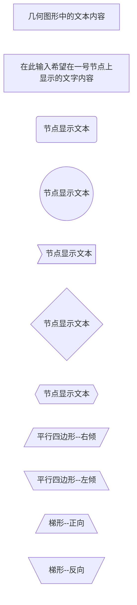
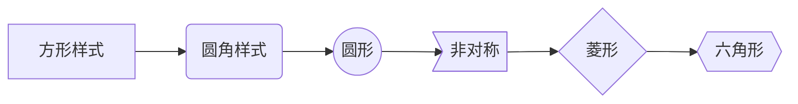
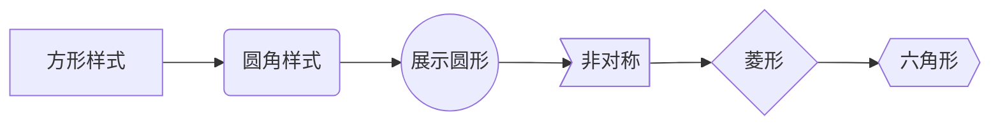
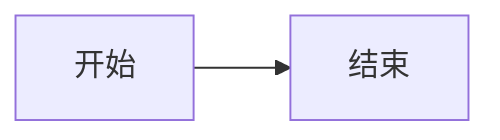
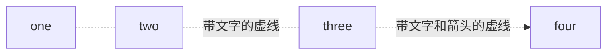
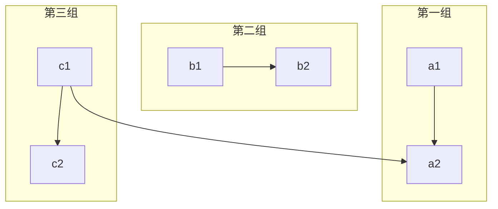
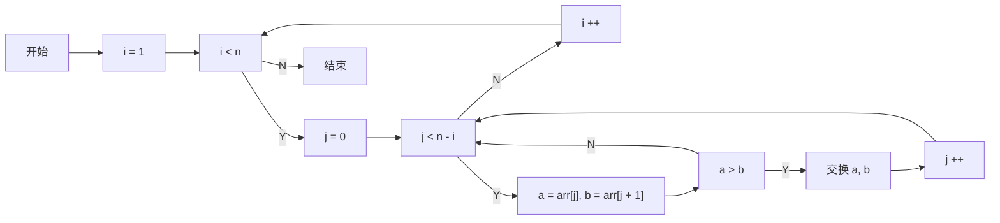

# 4.Markdown简单绘制流程图

Mermaid 是一个基于 Javascript 的图表绘制工具，通过解析类 Markdown 的文本语法来实现图表的创建和动态修改。Mermaid 诞生的主要目的是让文档的更新能够及时跟上开发进度。常用的图形有 “流程图”、“时序图”、“类图”、“状态图”、“甘特图”、"饼图" 等。

文档地址：
1. [https://github.com/mermaid-js/mermaid](https://github.com/mermaid-js/mermaid)
2. [https://mermaid.js.org/intro/](https://mermaid.js.org/intro/)

Mermaid 支持的图表类型包括：

- 流程图 (Flowchart) : 用关键词 graph 或 flowchart 表示
- 顺序图 (Sequence Diagram) : 用关键词 sequenceDiagram 表示
- 类图 (Class Diagram) : 用关键词 classDiagram 表示
- 状态图 (State Diagram) : 用关键词 stateDiagram 表示
- 实体关系图 (Entity Relationship Diagram) : 用关键词 erDiagram 表示
- 用户旅程图 (User Journey Diagram) : 用关键词 journey 表示
- 甘特图 (Gantt Diagram) : 用关键词 gantt 表示
- 饼图 (Pie Chart Diagram) : 用关键词 pie 表示
- 象限图 (Quadrant Chart) : 用关键词 quadrantChart 表示
- 需求图 (Requirement Diagram) : 用关键词 requirementDiagram 表示
- Gitgraph 图 (Gitgraph Diagram) : 用关键词 gitGraph 表示
- 思维导图 (Mindmap) : 用关键词 mindmap 表示
- 时间线图 (Timeline Diagram) : 用关键词 timeline 表示

#### 语法
```
```mermaid
# 默认的几何图形
几何图形中的文本内容 

# 将节点的 ID 和显示文本区分开
一号节点[在此输入希望在一号节点上显示的文字内容] 

# 圆角形节点的语法
节点ID1(节点显示文本)

# 圆形节点的语法
节点ID2((节点显示文本))

# 非对称形节点的语法
节点ID3>节点显示文本]

# 菱形节点的语法
节点ID4{节点显示文本}

# 六角形节点的语法
节点ID5{{节点显示文本}}

# 平行四边形节点的语法
右倾平行四边形[/平行四边形--右倾/]
左倾平行四边形[\平行四边形--左倾\]

# 梯形节点的语法
  梯形[/梯形--正向\]
反向梯形[\梯形--反向/]
```
其渲染结果如下：


#### 流程图方向
| 标志 | 方向 |
| ------ | ------ |
| TB |	top bottom - 从上到下 |
| BT |	bottom top - 从下到上 |
| RL |	right left - 从右到左 |
| LR |	left right - 从左到右 |
| TD |	等同于 TB |

#### 流程块形状样式
```




```


#### 连接线
> 样式的含义：
> 有箭头：一般指数据流方向
> 无箭头：仅表示相关性
> 实线：强关联
> 虚线：弱关联

1. 箭头样式
```


2. 无向线段连接线
```


3. 点状链接线（虚线）
```



4. 加粗线条
```


5. 分组
```



#### 实例
```



