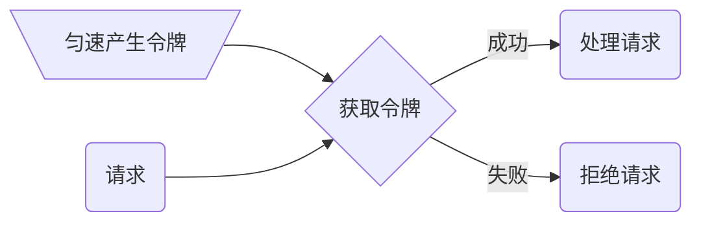
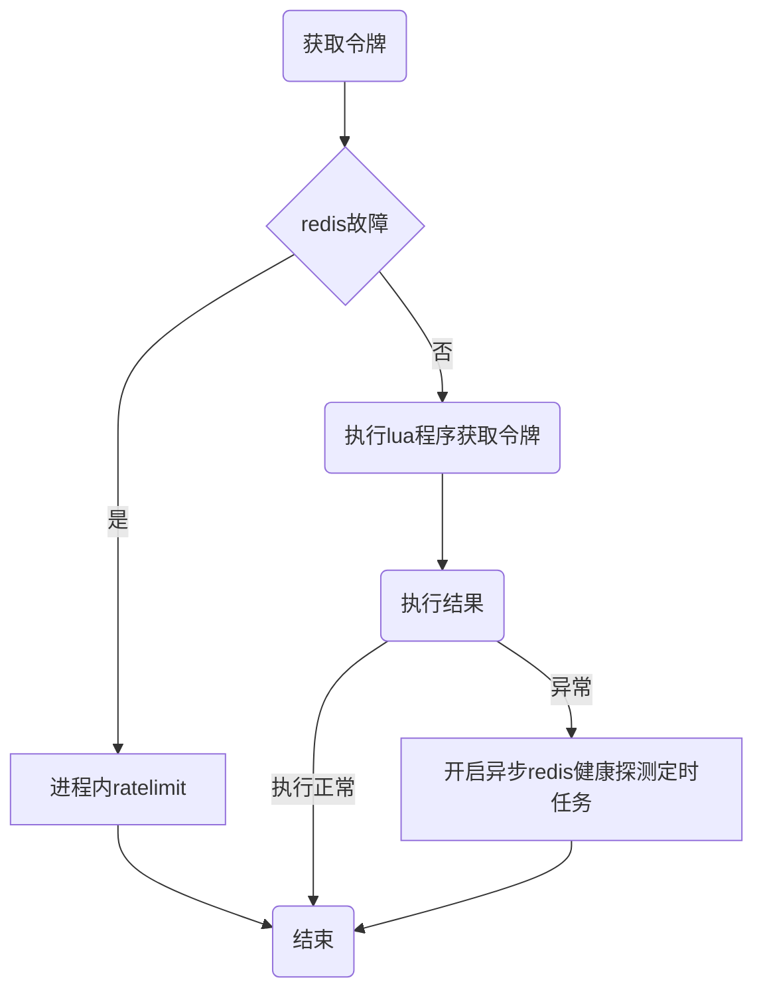

# Golang分布式令牌桶限流

#### 工作原理
单位时间按照一定速率匀速的生产 `token` 放入桶内，直到达到桶容量上限。
    
处理请求，每次尝试获取一个或多个令牌，如果拿到则处理请求，失败则拒绝请求。


- 优点
可以有效处理瞬间的突发流量，桶内存量 token 即可作为流量缓冲区平滑处理突发流量。

- 缺点
实现较为复杂。

#### 代码实现

`core/limit/tokenlimit.go`

分布式环境下考虑使用 redis 作为桶和令牌的存储容器，采用 lua 程序实现整个算法流程。

```lua
-- 每秒生成token数量即token生成速度
local rate = tonumber(ARGV[1])
-- 桶容量
local capacity = tonumber(ARGV[2])
-- 当前时间戳
local now = tonumber(ARGV[3])
-- 当前请求token数量
local requested = tonumber(ARGV[4])
-- 需要多少秒才能填满桶
local fill_time = capacity/rate
-- 向下取整,ttl为填满时间的2倍
local ttl = math.floor(fill_time*2)
-- 当前时间桶容量
local last_tokens = tonumber(redis.call("get", KEYS[1]))
-- 如果当前桶容量为0,说明是第一次进入,则默认容量为桶的最大容量
if last_tokens == nil then
last_tokens = capacity
end
-- 上一次刷新的时间
local last_refreshed = tonumber(redis.call("get", KEYS[2]))
-- 第一次进入则设置刷新时间为0
if last_refreshed == nil then
last_refreshed = 0
end
-- 距离上次请求的时间跨度
local delta = math.max(0, now-last_refreshed)
-- 距离上次请求的时间跨度,总共能生产token的数量,如果超多最大容量则丢弃多余的token
local filled_tokens = math.min(capacity, last_tokens+(delta*rate))
-- 本次请求token数量是否足够
local allowed = filled_tokens >= requested
-- 桶剩余数量
local new_tokens = filled_tokens
-- 允许本次token申请,计算剩余数量
if allowed then
new_tokens = filled_tokens - requested
end
-- 设置剩余token数量
redis.call("setex", KEYS[1], ttl, new_tokens)
-- 设置刷新时间
redis.call("setex", KEYS[2], ttl, now)

return allowed
```
    
令牌桶限流器定义
```go
type TokenLimiter struct {
    // 每秒生产速率
    rate int
    // 桶容量
    burst int
    // 存储容器
    store *redis.Redis
    // redis key
    tokenKey       string
    // 桶刷新时间key
    timestampKey   string
    // lock
    rescueLock     sync.Mutex
    // redis健康标识
    redisAlive     uint32
    // redis故障时采用进程内 令牌桶限流器
    rescueLimiter  *xrate.Limiter
    // redis监控探测任务标识
    monitorStarted bool
}

func NewTokenLimiter(rate, burst int, store *redis.Redis, key string) *TokenLimiter {
    tokenKey := fmt.Sprintf(tokenFormat, key)
    timestampKey := fmt.Sprintf(timestampFormat, key)

    return &TokenLimiter{
        rate:          rate,
        burst:         burst,
        store:         store,
        tokenKey:      tokenKey,
        timestampKey:  timestampKey,
        redisAlive:    1,
        rescueLimiter: xrate.NewLimiter(xrate.Every(time.Second/time.Duration(rate)), burst),
    }
}
```


```go
func (lim *TokenLimiter) reserveN(now time.Time, n int) bool {
    // 判断redis是否健康
    // redis故障时采用进程内限流器
    // 兜底保障
    if atomic.LoadUint32(&lim.redisAlive) == 0 {
        return lim.rescueLimiter.AllowN(now, n)
    }
    // 执行lua获取令牌
    resp, err := lim.store.Eval(
        script,
        []string{
            lim.tokenKey,
            lim.timestampKey,
        },
        []string{
            strconv.Itoa(lim.rate),
            strconv.Itoa(lim.burst),
            strconv.FormatInt(now.Unix(), 10),
            strconv.Itoa(n),
        })
    // redis allowed == false
    // Lua boolean false -> r Nil bulk reply
    // 特殊处理key不存在的情况
    if err == redis.Nil {
        return false
    } else if err != nil {
        logx.Errorf("fail to use rate limiter: %s, use in-process limiter for rescue", err)
        // 执行异常，开启redis健康探测任务
        // 同时采用进程内限流器作为兜底
        lim.startMonitor()
        return lim.rescueLimiter.AllowN(now, n)
    }

    code, ok := resp.(int64)
    if !ok {
        logx.Errorf("fail to eval redis script: %v, use in-process limiter for rescue", resp)
        lim.startMonitor()
        return lim.rescueLimiter.AllowN(now, n)
    }

    // redis allowed == true
    // Lua boolean true -> r integer reply with value of 1
    return code == 1
}
```

redis 故障时兜底策略

兜底策略的设计考虑得非常细节，当 redis 不可用的时候，启动单机版的 ratelimit 做备用限流，确保基本的限流可用，服务不会被冲垮。
```go
// 开启redis健康探测
func (lim *TokenLimiter) startMonitor() {
    lim.rescueLock.Lock()
    defer lim.rescueLock.Unlock()
    // 防止重复开启
    if lim.monitorStarted {
        return
    }

    // 设置任务和健康标识
    lim.monitorStarted = true
    atomic.StoreUint32(&lim.redisAlive, 0)
    // 健康探测
    go lim.waitForRedis()
}

// redis健康探测定时任务
func (lim *TokenLimiter) waitForRedis() {
    ticker := time.NewTicker(pingInterval)
    // 健康探测成功时回调此函数
    defer func() {
        ticker.Stop()
        lim.rescueLock.Lock()
        lim.monitorStarted = false
        lim.rescueLock.Unlock()
    }()

    for range ticker.C {
        // ping属于redis内置健康探测命令
        if lim.store.Ping() {
            // 健康探测成功，设置健康标识
            atomic.StoreUint32(&lim.redisAlive, 1)
            return
        }
    }
}
```

