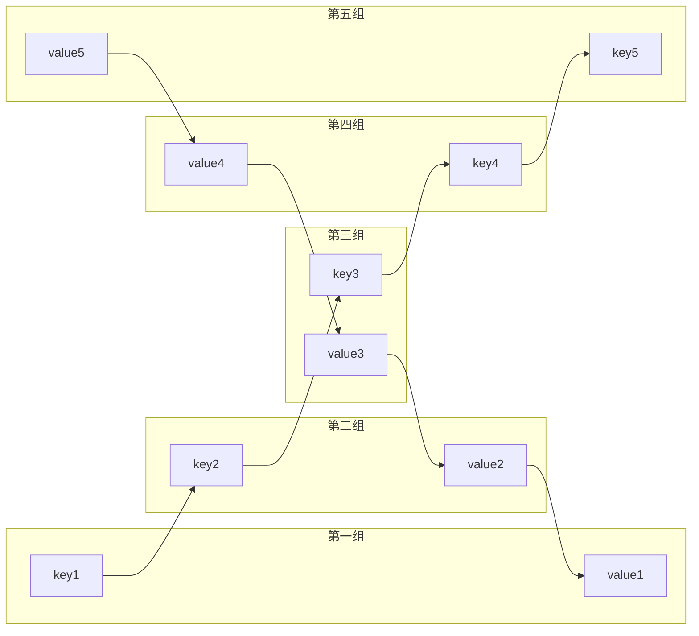

# Golang实现LRU算法缓存

哈希表是由若干个 Key-Value 所组成，在 “逻辑” 上这些 Key-Value 是没有排列顺序的。

在哈希链表当中，这些 Key-Value 被一个链条串连起来。每一个 Key-Value 都具有它的前驱 Key-Value、后继 Key-Value，就像双向链表中的节点一样，原本无序的哈希表拥有了固定的排列顺序。




代码实现：
```go
package main

import(
	"fmt"
)

type Node struct{
	Key interface{}
	Value interface{}
	pre *Node
	next *Node
}

type LRUCache struct{
	limit int
	HashMap map[interface{}]*Node
	head *Node
	end *Node
}


func (l *LRUCache) removeNode(n *Node) interface{} {
	if n == l.end{
		l.end = l.end.pre
		l.end.next = nil
	}else if n == l.head{
		l.head = l.head.next
		l.head.pre = nil
	}else{
		n.pre.next = n.next
		n.next.pre = n.pre
	}
	return n.Key
}

func (l *LRUCache) addNode(n *Node) {
	if l.end != nil {
		l.end.next = n
		n.pre = l.end
		n.next = nil
	}

	l.end = n

	if l.head == nil {
		l.head = n
	}
}

func (l *LRUCache) refreshNode(n *Node) {
	if n == l.end{
		return
	}

	//从链表的任意位置移除原来的位置，然后添加到链表的尾部
	l.removeNode(n)
	l.addNode(n)
}


//新建链表
func Newcache(capacity int) LRUCache {
	lruCache := LRUCache{
		limit: capacity,
		HashMap: make(map[interface{}]*Node, capacity),
	}

	return lruCache
}

//获取缓存
func (l *LRUCache) Get (key interface{}) interface{} {
	if v, ok := l.HashMap[key];ok {
		l.refreshNode(v)
		return v.Value
	}else{
		return -1
	}
}

//添加数据
func (l *LRUCache) Put (key interface{}, value interface{}) {
	if v, ok := l.HashMap[key]; ok {
		//保存新值，刷新位置
		v.Value = value
		l.refreshNode(v)
		return 
	}

	if len(l.HashMap) >= l.limit {
		//如果容量不够，则删除头节点
		oldKey := l.removeNode(l.head)
		delete(l.HashMap, oldKey)
	}

	//增加新节点
	n := Node{Key: key, Value: value}
	l.addNode(&n)
	l.HashMap[key] = &n

}

func (l *LRUCache) GetCache(){
	//循环打印所有节点
	for n := l.head; n != nil; n = n.next {
		fmt.Println(n.Key, n.Value)
	}
}


func main(){
	cache := Newcache(3)
	cache.Put(11, 1)
	cache.Put(22, 2)
	cache.Put(33, 3)
	cache.Put(44, 4)
	cache.Put(55, 5)

	v := cache.Get(33)
	fmt.Println(v)

	fmt.Println("========获取数据之后=======")
	cache.GetCache()
}
```
golang 标准库 `container/list` 包实现了基本的双向链表功能，包括元素的插入、删除、移动功能，可以实现类似缓存功能。

