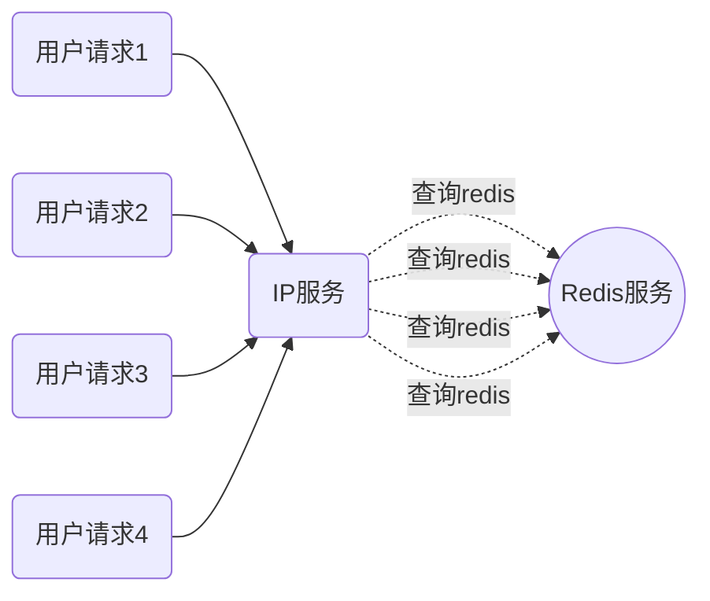
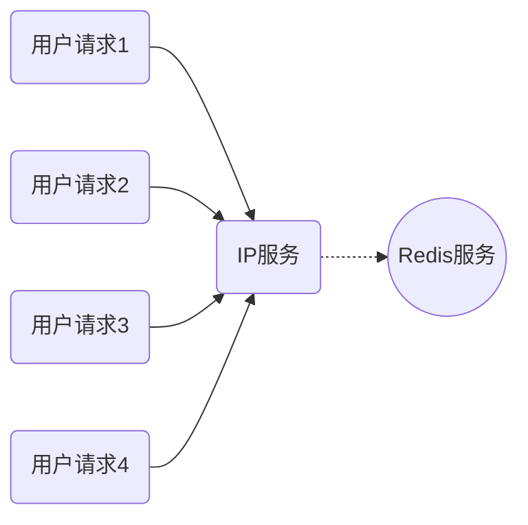
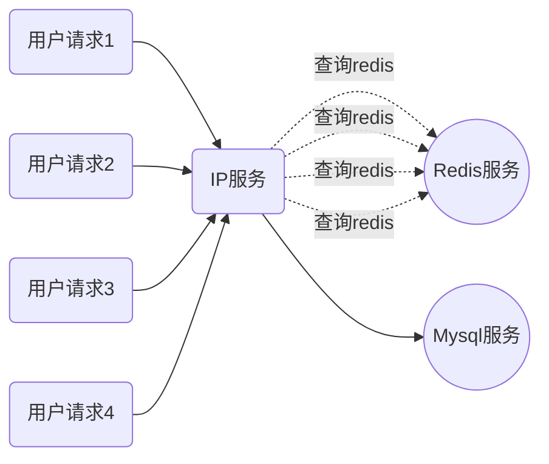

# Golang并发编程-SingleFlight

https://pkg.go.dev/golang.org/x/sync/singleflight

`go-zero`微服务框架使用了`singleflight`模式，**将并发请求合并成一个请求，以减少对下层服务的压力**。源码位于`core/syncx/singleflight.go`。


#### 应用场景

1. 查询缓存时，合并请求，提升服务性能。
  假设有一个 IP 查询的服务，每次用户请求先在缓存中查询一个 IP 的归属地，如果缓存中有结果则直接返回，不存在则进行 IP 解析操作。

  如上图所示，n 个用户请求查询同一个 IP（8.8.8.8）就会对应 n 个 Redis 的查询，在高并发场景下，如果能将 n 个 Redis 查询合并成一个 Redis 查询，那么性能肯定会提升很多，而 SingleFlight就是用来实现请求合并的，效果如下：


2. 防止缓存击穿
> 缓存击穿问题是指：在高并发的场景中，大量的请求同时查询一个 key ，如果这个 key 正好过期失效了，就会导致大量的请求都打到数据库，导致数据库的连接增多，负载上升。

通过`singleflight`可以将对同一个Key的并发请求进行合并，只让其中一个请求到数据库进行查询，其他请求共享同一个结果，可以很大程度提升并发能力。

#### 应用方式
```go
func main() {
  round := 10
  var wg sync.WaitGroup
  barrier := syncx.NewSingleFlight()
  wg.Add(round)
  for i := 0; i < round; i++ {
    go func() {
      defer wg.Done()
      // 启用10个协程模拟获取缓存操作
      val, err := barrier.Do("get_rand_int", func() (interface{}, error) {
        time.Sleep(time.Second)
        return rand.Int(), nil
      })
      if err != nil {
        fmt.Println(err)
      } else {
        fmt.Println(val)
      }
    }()
  }
  wg.Wait()
}
```
以上代码，模拟 10 个协程请求 Redis 获取一个 key 的内容，代码很简单，就是执行Do()方法。其中，接收两个参数，第一个参数是获取资源的标识，可以是 redis 中缓存的 key，第二个参数就是一个匿名函数，封装好要做的业务逻辑。最终获得的结果如下：
```
5577006791947779410
5577006791947779410
5577006791947779410
5577006791947779410
5577006791947779410
5577006791947779410
5577006791947779410
5577006791947779410
5577006791947779410
5577006791947779410
```
从上看出，10个协程都获得了同一个结果，也就是只有一个协程真正执行了rand.Int()获取了随机数，其他的协程都共享了这个结果。

#### 源码解析
```go
type (
  // 定义接口，有2个方法 Do 和 DoEx，其实逻辑是一样的，DoEx 多了一个标识，主要看Do的逻辑就够了
  SingleFlight interface {
    Do(key string, fn func() (interface{}, error)) (interface{}, error)
    DoEx(key string, fn func() (interface{}, error)) (interface{}, bool, error)
  }
  // 定义 call 的结构
  call struct {
    wg  sync.WaitGroup // 用于实现通过1个 call，其他 call 阻塞
    val interface{}    // 表示 call 操作的返回结果
    err error          // 表示 call 操作发生的错误
  }
  // 总控结构，实现 SingleFlight 接口
  flightGroup struct {
    calls map[string]*call // 不同的 call 对应不同的 key
    lock  sync.Mutex       // 利用锁控制请求
  }
)
```
```go
func (g *flightGroup) Do(key string, fn func() (interface{}, error)) (interface{}, error) {
  c, done := g.createCall(key)
  if done {
    return c.val, c.err
  }

  g.makeCall(c, key, fn)
  return c.val, c.err
}
```
代码很简洁，利用`g.createCall(key)`对 key 发起 call 请求（其实就是做一件事情），如果此时已经有其他协程已经在发起 call 请求就阻塞住（done 为 true 的情况），等待拿到结果后直接返回。如果 done 是 false，说明当前协程是第一个发起 call 的协程，那么就执行`g.makeCall(c, key, fn)`真正地发起 call 请求（此后的其他协程就阻塞在了`g.createCall(key)`)。
```mermaid
graph TD
    user("用户请求")
    call("第一个发起call的协程？")
    mc("makeCall获取结果")
    bk("阻塞等待获取结果")

    user-->call
    call-."yes".->mc
    call-."no".->bk
```

1. 判断是第一个请求的协程（利用map）
2. 阻塞住其他所有协程（利用 sync.WaitGroup）

来看下`g.createCall(key)`如何实现的：
```go
func (g *flightGroup) createCall(key string) (c *call, done bool) {
  g.lock.Lock()
  if c, ok := g.calls[key]; ok {
    g.lock.Unlock()
    c.wg.Wait()
    return c, true
  }

  c = new(call)
  c.wg.Add(1)
  g.calls[key] = c
  g.lock.Unlock()

  return c, false
}
```
第一步：判断是第一个请求的协程（利用map）
```go
g.lock.Lock()
if c, ok := g.calls[key]; ok {
  g.lock.Unlock()
  c.wg.Wait()
  return c, true
}
```
此处判断 map 中的 key 是否存在，如果已经存在，说明已经有其他协程在请求了，当前这个协程只需要等待，等待是利用了`sync.WaitGroup`的`Wait()`方法实现的，此处还是很巧妙的。要注意的是，map 在 Go 中是非并发安全的，所以需要加锁。

第二步：阻塞住其他所有协程（利用 `sync.WaitGroup`）
```go
c = new(call)
c.wg.Add(1)
g.calls[key] = c
```
因为是第一个发起 call 的协程，所以需要 new 这个 call，然后将`wg.Add(1)`，这样就对应了上面的`wg.Wait()`，阻塞剩下的协程。随后将 new 的 call 放入 map 中，注意此时只是完成了初始化，并没有真正去执行call请求，真正的处理逻辑在 `g.makeCall(c, key, fn)`中。
```go
func (g *flightGroup) makeCall(c *call, key string, fn func() (interface{}, error)) {
  defer func() {
    g.lock.Lock()
    delete(g.calls, key)
    g.lock.Unlock()
    c.wg.Done()
  }()

  c.val, c.err = fn()
}
```
执行传递的匿名函数`fn()`（也就是真正call请求要做的事情）。最后处理收尾的事情（通过defer），也是分成两步：
1. 删除 map 中的 key，使得下次发起请求可以获取新的值。
2. 调用`wg.Done()`，让之前阻塞的协程全部获得结果并返回。

