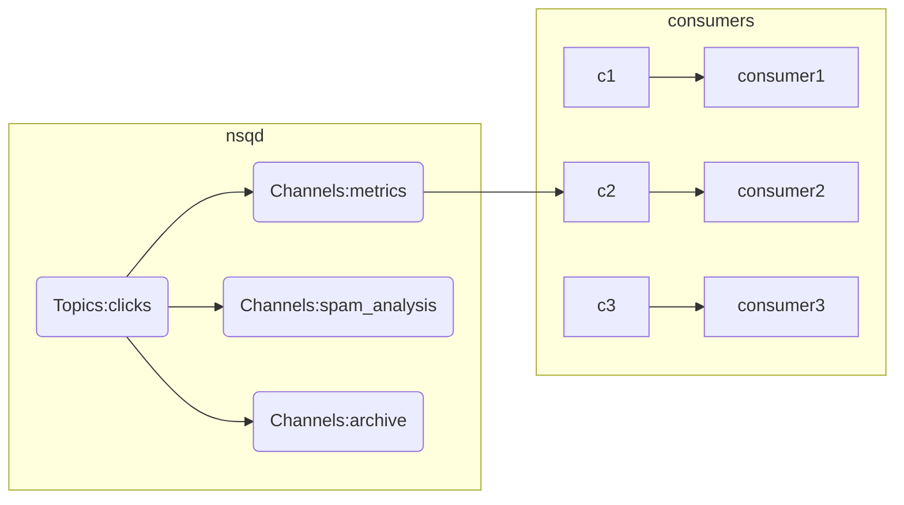

# Golang消息中间件NSQ

https://nsq.io/

https://pkg.go.dev/github.com/nsqio/go-nsq

NSQ 由 3 个守护进程组成:
- nsqd 是接收和传送消息到客户端的守护进程。
- nsqlookupd 是管理拓扑信息并提供了最终一致发现服务的守护进程。
- nsqadmin 是一个 Web UI 来实时监控集群 (执行各种管理任务)。

#### TOPIC 消息的逻辑关键词

topic 是 NSQ 消息发布的逻辑关键词，可以理解为人为定义的一种消息类型。当程序初次发布带 `topic` 的消息时，如果 `topic` 不存在，则会在 `nsqd` 中创建。类似其他消息中间件的 `topic` 机制。

#### PRODUCER 消息的生产者 / 发布者

producer 通过 HTTP API 将消息发布到 `nsqd` 的指定 `topic` ，一般有 `pub/mpub` 两种方式， `pub` 发布一个消息， `mpub` 一次发布多个消息。

producer 也可以通过 nsqd 客户端 的 TCP 接口 将消息发布给 `nsqd` 的指定 `topic` 。 当生产者 producer 初次发布带 topic 的消息给 nsqd 时，** 如果 topic 不存在，则会在 nsqd 中创建 topic **。

#### CHANNEL 消息传递的通道

当生产者每次发布消息的时候，消息会采用**多播**的方式被拷贝到各个 `channel` 中，channel 起到队列的作用。

channel 与 consumer (消费者) 相关，是消费者之间的负载均衡，消费者通过这个特殊的 channel 读取消息。

在 consumer 想单独获取某个 topic 的消息时，可以 `subscribe` (订阅) 一个自己单独命名的 nsqd 中还不存在的 channel， nsqd 会为这个 consumer 创建其命名的 `channel`。

Channel 会将消息进行排列，如果没有 consumer 读取消息，消息首先会在内存中排队，当量太大时就会被保存到磁盘中。可以在配置中配置具体参数。

一个 channel 一般会有多个 `consumer` 连接。假设所有已连接的 consumer 处于准备接收消息的状态，每个消息将被传递到一个**随机**的 consumer。

Go 语言中的 channel 是表达队列的一种自然方式，因此一个 NSQ 的 `topic/channel`，其核心就是一个存放消息指针的 Go-channel 缓冲区。缓冲区的大小由 --mem-queue-size 配置参数确定。

#### CONSUMER 消息的消费者

consumer 通过 TCP subscribe 自己需要的 `channel`。

`topic` 和 `channel` 都没有预先配置。 `topic` 由第一次发布消息到这个 `topic` 的 producer 创建 或第一次通过 subscribe 订阅一个命名 `topic` 的 consumer 来创建。

`channel` 被 consumer 第一次 subscribe 订阅到指定的 `channel` 创建。

多个 consumer subscribe 一个 `channel`，假设所有已连接的客户端处于准备接收消息的状态，每个消息将被传递到一个 **随机** 的 consumer。

1. NSQ 支持延时消息， consumer 在配置的延时时间后才能接受相关消息。

2. Channel 在 consumer 退出后并不会删除，这点需要特别注意。


nsq `channel` 如图所示，clicks topic 有 3 个 `channel` 订阅消息，生产的消息 A 和消息 B，都被复制到了三个 `channel`（分别是 metrics，spam_analysis，arvhive），但是 metrics 这个 `channel` 下 的三个 consumer，对于每一个消息都只会有一个 consumer 被选中来消费消息。

#### 测试环境
```yaml
version: '3'
services:
  nsqlookupd:
    image: nsqio/nsq
    command: /nsqlookupd
    restart: always
    ports:
      - 4160:4160
      - 4161:4161
  nsqd:
    image: nsqio/nsq
   # broadcast-address address that will be registered with lookupd (defaults to the OS hostname) (default "yourhost.local")
   # broadcast-address 是nsqd所在主机的IP地址，并会将该地址注册保存到lookupd让消费者获取访问nsqd
   # command: /nsqd --lookupd-tcp-address=nsqlookupd:4160 --data-path=/data --broadcast-address=0.0.0.0
    command: /nsqd --lookupd-tcp-address=nsqlookupd:4160 --data-path=/data --broadcast-address=192.168.1.5
    restart: always
    depends_on:
      - nsqlookupd
    volumes:
    - ./nsqd/data:/data
    ports:
      - 4150:4150
      - 4151:4151
  nsqadmin:
    image: nsqio/nsq
    command: /nsqadmin --lookupd-http-address=nsqlookupd:4161
    restart: always
    depends_on:
      - nsqlookupd
    ports:
      - 4171:4171
```
- nsqlookupd

http://192.168.1.5:4161/ping

http://192.168.1.5:4161/info
```json
{"version":"1.2.1"}
```
http://192.168.1.5:4161/nodes
```json
{"producers":[{"remote_address":"172.25.0.3:47602","hostname":"64bbb1d54376","broadcast_address":"192.168.1.5","tcp_port":4150,"http_port":4151,"version":"1.2.1","tombstones":[false,false],"topics":["topic","topic001"]}]}
```
- nsqd

http://192.168.1.5:4151/ping

http://192.168.1.5:4151/info
```json
{"version":"1.2.1","broadcast_address":"192.168.1.5","hostname":"64bbb1d54376","http_port":4151,"tcp_port":4150,"start_time":1658107924}
```
http://192.168.1.5:4151/stats
```
nsqd v1.2.1 (built w/go1.16.7)
start_time 2022-07-18T01:32:04Z
uptime 47m49.229582656s

Health: OK

Memory:
   heap_objects             	20687
   heap_idle_bytes          	63561728
   heap_in_use_bytes        	2859008
   heap_released_bytes      	63496192
   gc_pause_usec_100        	0
   gc_pause_usec_99         	0
   gc_pause_usec_95         	0
   next_gc_bytes            	4473924
   gc_total_runs            	0

Topics:
   [topic] depth: 5     be-depth: 5     msgs: 0        e2e%: 

   [topic001] depth: 0     be-depth: 0     msgs: 3        e2e%: 
      [chan001] depth: 0     be-depth: 0     inflt: 0    def: 0    re-q: 0     timeout: 0     msgs: 3        e2e%: 
        [V2 gary-asus:41268 go-nsq/1.1.0] state: 3 inflt: 0    rdy: 1    fin: 3        re-q: 0        msgs: 3        connected: 47m29s

Producers: None
```
- nsqadmin

http://192.168.1.5:4171/

#### 示例代码

消费者 producer.go
```go
package main

import (
	"log"
	"time"

	"github.com/nsqio/go-nsq"
)

func main() {
	// Instantiate a producer.
	config := nsq.NewConfig()
	producer, err := nsq.NewProducer("192.168.1.5:4150", config)
	if err != nil {
		log.Fatal(err)
	}

	messageBody := []byte("hello god nsq")
	topicName := "topic001"

	// Synchronously publish a single message to the specified topic.
	// Messages can also be sent asynchronously and/or in batches.
	err = producer.Publish(topicName, messageBody)
	if err != nil {
		log.Fatal(err)
	}

	// 延时消息
	//DeferredPublish synchronously publishes a message body to the specified topic where the message will queue at the channel level until the timeout expires, returning an error if publish failed
	err = producer.DeferredPublish(topicName, 10*time.Second, messageBody) // 消费者10秒后收到消息
	if err != nil {
		log.Fatal(err)
	}

	// Gracefully stop the producer when appropriate (e.g. before shutting down the service)
	producer.Stop()
}
```

消费者 consumer.go
```go
package main

import (
	"log"
	"os"
	"os/signal"
	"syscall"

	"github.com/nsqio/go-nsq"
)

type myMessageHandler struct{}

// HandleMessage implements the Handler interface.
func (h *myMessageHandler) HandleMessage(m *nsq.Message) error {
	if len(m.Body) == 0 {
		// Returning nil will automatically send a FIN command to NSQ to mark the message as processed.
		// In this case, a message with an empty body is simply ignored/discarded.
		return nil
	}

	// do whatever actual message processing is desired
	err := processMessage(m.Body)

	// Returning a non-nil error will automatically send a REQ command to NSQ to re-queue the message.
	return err
}

func processMessage(msg []byte) error {
	log.Println(string(msg))
	return nil
}

func main() {
	// Instantiate a consumer that will subscribe to the provided channel.
	config := nsq.NewConfig()
	consumer, err := nsq.NewConsumer("topic001", "chan001", config)
	if err != nil {
		log.Fatal(err)
	}

	// Set the Handler for messages received by this Consumer. Can be called multiple times.
	// See also AddConcurrentHandlers.
	consumer.AddHandler(&myMessageHandler{})

	// Use nsqlookupd to discover nsqd instances.
	// See also ConnectToNSQD, ConnectToNSQDs, ConnectToNSQLookupds.
	err = consumer.ConnectToNSQLookupd("192.168.1.5:4161")
	if err != nil {
		log.Fatal(err)
	}

	// wait for signal to exit
	sigChan := make(chan os.Signal, 1)
	signal.Notify(sigChan, syscall.SIGINT, syscall.SIGTERM)
	<-sigChan

	// Gracefully stop the consumer.
	consumer.Stop()
}
```

