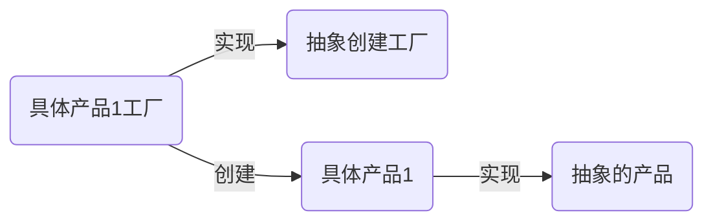

# Golang设计模式-工厂方法模式

#### 概念
工厂方法模式又称为工厂模式，也叫虚拟构造器模式或者多态工厂模式，它属于类创建型模式

在工厂方法模式中，工厂父类负责定义创建产品对象的公共接口，而工厂子类则负责生成具体的产品对象

#### 结构图

#### 总结
保持了简单工厂模式的优点，克服了简单工厂模式的缺点

在添加新产品时，在一定程度上增加了系统的复杂度

适合调用者不需要知道具体产品类的类名，只需要知道所对应的工厂即可

#### 示例代码 1
```go
package demo1

// 工厂方法模式

type Product interface {
	SetName(name string)
	GetName() string
}

// 产品1
type Product1 struct {
	name string
}

func (p1 *Product1) SetName(name string) {
	p1.name = name
}

func (p1 *Product1) GetName() string {
	return "prod1 name is: " + p1.name
}

// 产品2
type Product2 struct {
	name string
}

func (p2 *Product2) SetName(name string) {
	p2.name = name
}

func (p2 *Product2) GetName() string {
	return "prod2 name is: " + p2.name
}

// 抽象工厂接口
type FactoryProduct interface {
	Create() Product
}

type FactoryProduct1 struct{}

func (fp1 *FactoryProduct1) Create() Product {
	return &Product1{}
}

type FactoryProduct2 struct{}

func (fp2 *FactoryProduct2) Create() Product {
	return &Product2{}
}
```

```go
package demo1

import (
	"testing"
)

func TestFactoryProduct1(t *testing.T) {
	factory := (&FactoryProduct1{}).Create()
	factory.SetName("zhangsan")
	t.Logf(factory.GetName())
}

func TestFactoryProduct2(t *testing.T) {
	factory := (&FactoryProduct2{}).Create()
	factory.SetName("lisi")
	t.Logf(factory.GetName())
}
```
#### 示例代码 2
```go
package cache2

// cache 接口定义，作为父类
type Cache interface {
	SetValue(key string, value string)
	GetValue(key string) string
}

// 实现具体的cache： redis
type RedisCache struct {
	data map[string]string
}

func (r *RedisCache) SetValue(key string, value string) {
	r.data[key] = value
}

func (r *RedisCache) GetValue(key string) string {
	return "redis:" + r.data[key]
}

func NewRedisCache() *RedisCache {
	return &RedisCache{
		data: make(map[string]string),
	}
}

// 实现具体的cache： memory
type MemoryCache struct {
	data map[string]string
}

func (r *MemoryCache) SetValue(key string, value string) {
	r.data[key] = value
}

func (r *MemoryCache) GetValue(key string) string {
	return "memory:" + r.data[key]
}

func NewMemoryCache() *MemoryCache {
	return &MemoryCache{
		data: make(map[string]string),
	}
}

// 实现cache的工厂方法
type CacheFactory interface {
	Create() Cache
}

type RedisCacheFactory struct{}

func (rcf *RedisCacheFactory) Create() Cache {
	return NewRedisCache()
}

type MemoryCacheFactory struct{}

func (mcf *MemoryCacheFactory) Create() Cache {
	return NewMemoryCache()
}
```

```go
package cache2

import (
	"testing"
)

func TestRedisCacheFactory(t *testing.T) {
	var factory CacheFactory
	factory = &RedisCacheFactory{}
	cache := factory.Create()
	cache.SetValue("k1", "v1")
	t.Logf(cache.GetValue("k1"))
}

func TestMemoryCacheFactory(t *testing.T) {
	var factory CacheFactory
	factory = &MemoryCacheFactory{}
	cache := factory.Create()
	cache.SetValue("k2", "v2")
	t.Logf(cache.GetValue("k2"))
}
```

