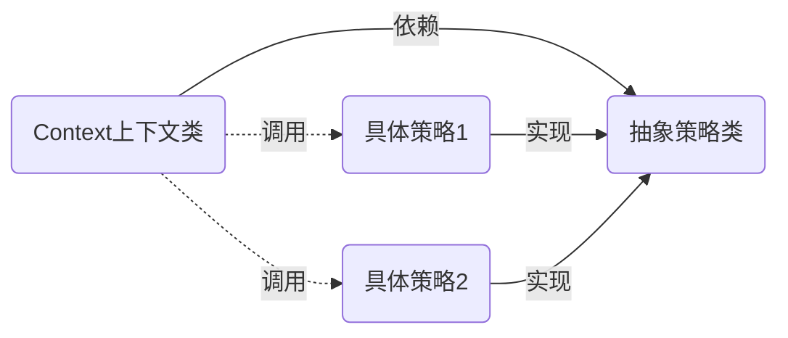

# Golang设计模式-策略模式

#### 概念：
指结构体有某个行为，但是在不同的场景，该行为有不同的算法。

#### 结构图：


#### 优点：
对 “开闭原则” 的完美支持

适合一个系统需要根据不同场景动态的在几种算法或行为中选择一种

避免使用多重条件判断语句

提供了管理相关的算法族的办法

#### 缺点：
调用者必须先知道所有策略类并自己决定使用哪一个策略类

策略模式将产生很多策略结构体

#### 代码示例 1：
```go
package strategy1

import (
	"log"
)

type Context struct {
	Strategy
}

// 定义策略规则（接口）
type Strategy interface {
	Do()
}

// 策略1
type Strategy1 struct {
}

func (s *Strategy1) Do() {
	log.Println("run strategy1...")
}

// 策略2
type Strategy2 struct {
}

func (s *Strategy2) Do() {
	log.Println("run strategy2...")
}
```

```go
package strategy1

import (
	"testing"
)

func TestStrategy1(t *testing.T) {
	var c *Context
	c = &Context{}
	c.Strategy = &Strategy1{}
	c.Do()
}

func TestStrategy2(t *testing.T) {
	var c *Context
	c = &Context{}
	c.Strategy = &Strategy2{}
	c.Do()
}
```

#### 代码示例 2：

实现一个日志记录器：实现文件和数据库存储两种方式
```go
package strategy2

import (
	"fmt"
)

// 实现一个日志记录器结构体
type LogManager struct {
	Logger
}

func NewLogManager(logger Logger) *LogManager {
	return &LogManager{
		Logger: logger,
	}
}

// 抽象的日志接口
type Logger interface {
	Info()
	Error()
}

// 文件方式日志
type FileLogger struct {
}

func (fl *FileLogger) Info() {
	fmt.Println("文件方式记录Info日志。。。")
}

func (fl *FileLogger) Error() {
	fmt.Println("文件方式记录Error日志。。。")
}

// 数据库方式日志
type DbLogger struct {
}

func (dl *DbLogger) Info() {
	fmt.Println("数据库方式记录Info日志。。。")
}

func (dl *DbLogger) Error() {
	fmt.Println("数据库方式记录Error日志。。。")
}
```

```go
package strategy2

import (
	"testing"
)

func TestLogManager(t *testing.T) {
	fileLogger := &FileLogger{}
	logManager := NewLogManager(fileLogger)
	logManager.Error()
	logManager.Info()

	dbLogger := &DbLogger{}
	logManager = NewLogManager(dbLogger)
	logManager.Error()
	logManager.Info()
}
```

