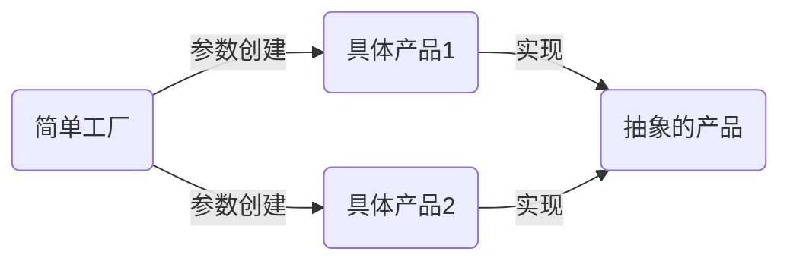

# Golang设计模式-简单工厂模式

#### 概念
属于创建型模式，又叫做静态工厂方式模式

可以根据参数的不同返回不同类（结构体）的实例

专门定义一个类（结构体）来负责创建其他类（结构体）的实例，被创建的实例通常都具有共同的父类（结构体）

#### 结构图


#### 优点
实现了解耦，适合创建的对象比较少的情况

#### 缺点
违背了 “开闭原则”

#### 代码示例 1
```go
package factory1

// 简单工厂模式
// 实现一个抽象的产品
type Product interface {
	SetName(name string)
	GetName() string
}

// 实现具体的产品1
type Product1 struct {
	name string
}

func (p1 *Product1) SetName(name string) {
	p1.name = name
}

func (p1 *Product1) GetName() string {
	return "prod1 name is: " + p1.name
}

// 实现具体的产品2
type Product2 struct {
	name string
}

func (p2 *Product2) SetName(name string) {
	p2.name = name
}

func (p2 *Product2) GetName() string {
	return "prod2 name is: " + p2.name
}

// 实现简单工厂类
type productType int

const (
	p1 productType = iota //0
	p2
)

type productFactory struct {
}

func (pf productFactory) Create(productType productType) Product {
	if productType == p1 {
		return &Product1{}
	}
	if productType == p2 {
		return &Product2{}
	}
	return nil
}
```

```go
package factory1

import (
	"testing"
)

func TestProduct_Create(t *testing.T) {
	prod1 := &Product1{}
	prod1.SetName("zhangsan")
	t.Logf("%s \n", prod1.GetName())

	prod2 := &Product2{}
	prod2.SetName("lisi")
	t.Logf("%s \n", prod2.GetName())
}

func TestProductFactory_Create(t *testing.T) {
	factory := &productFactory{}

	prod1 := factory.Create(p1)
	prod1.SetName("wangwu")
	t.Logf(prod1.GetName())

	prod2 := factory.Create(p2)
	prod2.SetName("zhaoliu")
	t.Logf(prod2.GetName())
}
```

#### 代码示例 2
```go
package cache1

import (
	"errors"
)

// cache 接口定义，作为父类
type Cache interface {
	SetValue(key string, value string)
	GetValue(key string) string
}

// 实现具体的cache： redis
type RedisCache struct {
	data map[string]string
}

func (r *RedisCache) SetValue(key string, value string) {
	r.data[key] = value
}

func (r *RedisCache) GetValue(key string) string {
	return "redis:" + r.data[key]
}

// 实现具体的cache： memory
type MemoryCache struct {
	data map[string]string
}

func (r *MemoryCache) SetValue(key string, value string) {
	r.data[key] = value
}

func (r *MemoryCache) GetValue(key string) string {
	return "memory:" + r.data[key]
}

// 实现cache的简单工厂

type cacheType int

const (
	CACHE_REDIS cacheType = iota // 0
	CACHE_MEMORY
)

type CacheFactory struct{}

func (cf CacheFactory) Create(cacheType cacheType) (Cache, error) {
	if cacheType == CACHE_REDIS {
		return &RedisCache{
			data: make(map[string]string),
		}, nil
	}
	if cacheType == CACHE_MEMORY {
		return &MemoryCache{
			data: make(map[string]string),
		}, nil
	}
	return nil, errors.New("unknown cache type")
}
```
```go
package cache1

import (
	"testing"
)

func TestCacheFactory(t *testing.T) {
	factory := CacheFactory{}

	redis, err := factory.Create(CACHE_REDIS)
	if err != nil {
		t.Errorf("factory create fail:%s", err)
	}
	redis.SetValue("zhangsan", "34")
	t.Logf(redis.GetValue("zhangsan"))

	memory, err := factory.Create(CACHE_MEMORY)
	if err != nil {
		t.Errorf("factory create fail:%s", err)
	}
	memory.SetValue("lisi", "33")
	t.Logf(memory.GetValue("lisi"))
}
```

