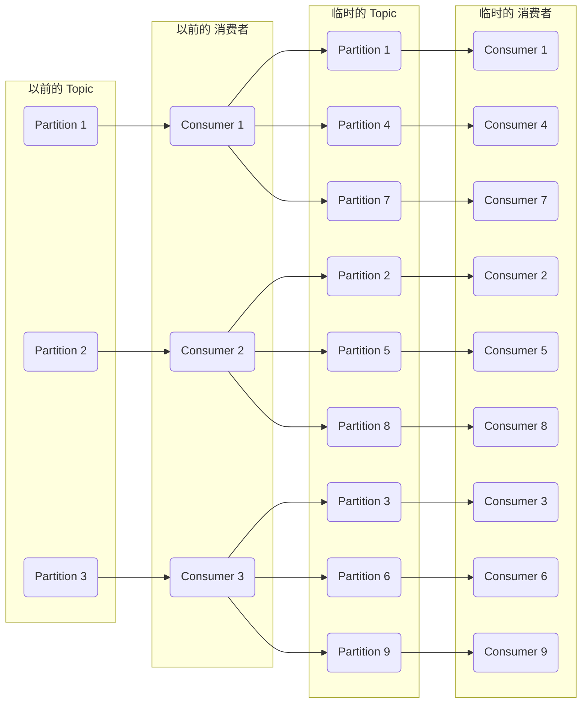

# Kafka-消息堆积-重复消费-消息丢失

#### 消息堆积
例如，积压了 100 万条，有 3 个 Consumer，每一个每秒能处理 200 条，3 个 Consumer 每秒一共能处理 600 条。 大概需要一个多小时才能处理完。

这一个多小时又会积压新的消息

所以正常处理肯定不行，需要提速。

例如 Kafka，这个消息积压的 Topic 有 3 个 Partition，那最多就能用 3 个 Consumer，所以增加 Consumer 没有用。

还是可以使用**临时队列**的方式。


新建一个 临时 Topic，设置为 10 个 Partition。

以前旧的 3 个 Consumer 不再处理业务逻辑了，改为只负责搬运，把消息分发放到临时 Topic 中（或者停掉旧的 3 个 Consumer，再新建 3 个 Consumer 只做分发逻辑）。

临时 Topic 这 10 个 Partition 可以有 10 个 新建 Consumer 了，它们来处理原来的业务逻辑。

这 10 个 Consumer 每秒一共能处理 2000 条了，这样十几分钟就可以处理完积压的 100 万条。

之后，再把整体结构恢复为原来的形式。

#### 消息过期
首先，要实现防止消息过期问题，消息不应该设置过期时间。

如果就是设置了过期时间导致了消息丢失，怎么补救呢？

那就只能在访问量最低的时候，写一个临时程序来补消息了。

例如有订单消息丢了，那就需要找出哪些订单消息丢了，然后重新发到队列。

#### 消息回溯
如果某段时间对已消费消息计算的结果觉得有问题，可能是由于程序 bug 导致的计算错误，当程序 bug 修复后可能需要对之前已消费的消息进行重新消费。这种情况可以用 consumer 的 `offsetsForTimes`、`seek` 等方法指定从某个 `offset` 偏移量的消息开始回溯消费。

#### 重复消费
无论是生产者还是消费者的重复消费，一般都会在消费端卡死，做幂等性处理。

幂等性可以用 redis 的 `setnx` 分布式锁来实现。比如操作订单消息，可以把订单 id 作为 key，在消费消息时通过 setnx 命令设置一下，offset 提交完成后在 redis 中删除订单 id 的 key。setnx 命令保证同样的订单消息只有一个能被消费，可有效保证消费的幂等性！

> Redis Setnx（SET if Not eXists） 命令在指定的 key 不存在时，为 key 设置指定的值。key 不存在时设置成功，返回 1 。 key 已经存在时会设置失败，返回 0 。

- 消费幂等性(Idempotent Consumer)：使用消息的唯一标识符(Message ID)来判断消息是否已经被消费过，如果已经消费过，则不会重复处理。

- 限制重复消费时间窗口：在消费者处理消息的过程中，可以设置一个时间窗口，在这个时间窗口内的消息不会重复消费。这个时间窗口可以通过消费者的配置参数来设置。

- 消息去重：如果消息内容可以被唯一标识，可以使用消息去重的方式来解决重复消费的问题。例如，使用消息内容的Hash值作为唯一标识符，如果相同的Hash值出现多次，则只处理一次。

#### 消息丢失
1. 生产者消息丢失

生产者在发送消息时会有一个 ack 机制，当 ack=0 或者 ack=1 时，都可能会丢消息。

`acks=0`： 表示 `producer` 不需要等待任何 broker 确认收到消息的回复就可以继续发送下一条消息。性能最高，但是最容易丢消息。适合大数据统计报表场景，对性能要求很高，对数据丢失不敏感的情况。

`acks=1`： 至少要等待 `leader` 已经成功将数据写入本地 log，不需要等待所有 follower 是否成功写入就可以继续发送下一条消息。这种情况下，如果 follower 没有成功备份数据，而此时 leader 又挂掉，则消息会丢失。

`acks=-1` 或 `acks=all`： 这意味着 `leader` 需要等待所有备份 (`min.insync.replicas` 配置的备份个数) 都成功写入日志，这种策略会保证只要有一个备份存活就不会丢失数据。一般是金融级别场景才会使用这种配置。当然如果 `min.insync.replicas` 配置的是 1 则也可能丢消息，跟 `acks=1` 情况类似。

2. 消费端消息丢失

消费端丢消息最主要体现在消费端 offset 的自动提交。开启了自动提交，如果某一次消费的数据还没处理完，此时 `consumer` 直接宕机了，未处理完的数据丢失了，下次也不能重新消费这个消息，因为 offset 已经提交完毕，下次会从 offset 开始消费新消息。

解决办法是采用消费端的手动提交
```go
//手动提交offset
/**
  * 注意如果要使用手动提交offset，需要以下三点
  * ①：配置文件配置手动提交方式
  * ②：加上参数Acknowledgment ack
  * ③：方法中使用ack.acknowledge();手动提交
  */
ack.acknowledge();
```


