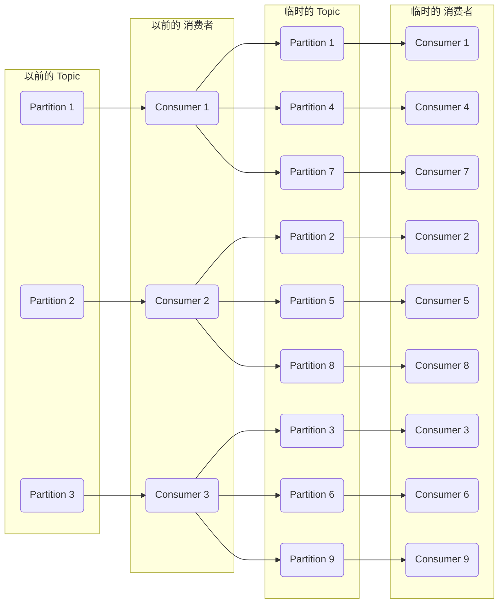

# Kafka消息队列严重堆积

#### 消息堆积
例如，积压了 100 万条，有 3 个 Consumer，每一个每秒能处理 200 条，3 个 Consumer 每秒一共能处理 600 条。 大概需要一个多小时才能处理完。

这一个多小时又会积压新的消息

所以正常处理肯定不行，需要提速。

例如 Kafka，这个消息积压的 Topic 有 3 个 Partition，那最多就能用 3 个 Consumer，所以增加 Consumer 没有用。

还是可以使用**临时队列**的方式。

新建一个 临时 Topic，设置为 10 个 Partition。

以前旧的 3 个 Consumer 不再处理业务逻辑了，改为只负责搬运，把消息分发放到临时 Topic 中（或者停掉旧的 3 个 Consumer，再新建 3 个 Consumer 只做分发逻辑）。

临时 Topic 这 10 个 Partition 可以有 10 个 新建 Consumer 了，它们来处理原来的业务逻辑。

这 10 个 Consumer 每秒一共能处理 2000 条了，这样十几分钟就可以处理完积压的 100 万条。

之后，再把整体结构恢复为原来的形式。

#### 消息被丢弃
首先，要实现防止消息过期问题，消息不应该设置过期时间。

如果就是设置了过期时间导致了消息丢失，怎么补救呢？

那就只能在访问量最低的时候，写一个临时程序来补消息了。

例如有订单消息丢了，那就需要找出哪些订单消息丢了，然后重新发到队列。

