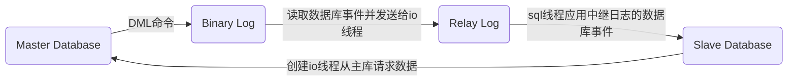

# MySQL使用docker创建主从复制

要对数据库进行扩展，主要形式为：扩展多台数据库实例，实现读写分离，对于一些写的任务分配到主数据库，对于读的任务使用从数据库。

#### 主从复制的原理
MySql 主库在事务提交时会把数据变更作为事件记录在二进制日志 `Binlog` 中；
    
主库推送二进制日志文件 `Binlog` 中的事件到从库的中继日志 `Relay Log` 中，从库依据中继日志重做数据变更操作，通过**逻辑复制**来达到主库和从库的数据一致性；

MySql 通过**三个线程**来完成主从库间的数据复制，其中 `Binlog Dump` 线程跑在主库上，`I/O` 线程和 `SQL` 线程运行在从库上；

当在从库上启动复制时，首先创建 `I/O` 线程连接主库，主库随后创建 `Binlog Dump` 线程读取数据库事件并发送给 `I/O` 线程，`I/O` 线程获取到事件数据后更新到从库的中继日志 `Relay Log` 中去，之后从库上的 `SQL` 线程读取中继日志 `Relay Log` 中更新的数据库事件并应用。



1. 主实例搭建
```sh
docker run -p 3307:3306 --name mysql-master \
-v /mydata/mysql-master/log:/var/log/mysql \
-v /mydata/mysql-master/data:/var/lib/mysql \
-v /mydata/mysql-master/conf:/etc/mysql \
-e MYSQL_ROOT_PASSWORD=root  \
-d mysql:5.7
```
在 mysql 的配置文件夹 `/mydata/mysql-master/conf` 中创建一个配置文件 `my.cnf`

修改配置文件 `my.cnf`
```sh
[mysqld]
## 设置server_id，同一局域网中需要唯一
server_id=101 
## 指定不需要同步的数据库名称
binlog-ignore-db=mysql  
## 开启二进制日志功能（日志文件名称）
log-bin=mysql-master-bin  
## 设置二进制日志使用内存大小（事务）
binlog_cache_size=1M  
## 设置使用的二进制日志格式（mixed,statement,row）
binlog_format=mixed  
## 二进制日志过期清理时间。默认值为0，表示不自动清理。
expire_logs_days=7  
## 跳过主从复制中遇到的所有错误或指定类型的错误，避免slave端复制中断。
## 如：1062错误是指一些主键重复，1032错误是因为主从数据库数据不一致
slave_skip_errors=1062
```
修改完配置后重启实例 `docker restart mysql-master`

进入 mysql-master 容器中 `docker exec -it mysql-master /bin/bash`

在容器中使用 mysql 的登录命令连接到客户端 `mysql -uroot -proot`

创建数据同步用户
```sql
CREATE USER 'slave'@'%' IDENTIFIED BY '123456';

GRANT REPLICATION SLAVE, REPLICATION CLIENT ON *.* TO 'slave'@'%';
```

2. 从实例搭建
```sh
docker run -p 3308:3306 --name mysql-slave \
-v /mydata/mysql-slave/log:/var/log/mysql \
-v /mydata/mysql-slave/data:/var/lib/mysql \
-v /mydata/mysql-slave/conf:/etc/mysql \
-e MYSQL_ROOT_PASSWORD=root  \
-d mysql:5.7
```

在 mysql 的配置文件夹 `/mydata/mysql-slave/conf` 中创建一个配置文件 `my.cnf`

修改配置文件 `my.cnf`
```sh
[mysqld]
## 设置server_id，同一局域网中需要唯一
server_id=102
## 指定不需要同步的数据库名称
binlog-ignore-db=mysql  
## 开启二进制日志功能，Slave也可以作为其它数据库实例的Master时使用
log-bin=mysql-slave1-bin  
## 设置二进制日志使用内存大小（事务）
binlog_cache_size=1M  
## 设置使用的二进制日志格式（mixed,statement,row）
binlog_format=mixed  
## 二进制日志过期清理时间。默认值为0，表示不自动清理。
expire_logs_days=7  
## 跳过主从复制中遇到的所有错误或指定类型的错误，避免slave端复制中断。
## 如：1062错误是指一些主键重复，1032错误是因为主从数据库数据不一致
slave_skip_errors=1062  
## relay_log配置中继日志
relay_log=mysql-relay-bin  
## log_slave_updates表示slave将复制事件写进自己的二进制日志
log_slave_updates=1  
## slave设置为只读（具有super权限的用户除外）
read_only=1
```
修改完配置后重启实例 `docker restart mysql-slave`

3. 主从数据库进行连接

连接到主数据库的 mysql 客户端，查看主数据库状态 `show master status;`

进入 mysql-slave 容器中 `docker exec -it mysql-slave /bin/bash`

使用 mysql 的登录命令连接到客户端 `mysql -uroot -proot`

在从数据库中配置主从复制 
```sql
change master to master_host='192.168.1.7', master_user='slave', master_password='123456', master_port=3307, master_log_file='mysql-master-bin.000001', master_log_pos=617, master_connect_retry=30;
```

主从复制命令参数说明：
- master_host：主数据库的IP地址；
- master_port：主数据库的运行端口；
- master_user：在主数据库创建的用于同步数据的用户账号；
- master_password：在主数据库创建的用于同步数据的用户密码；
- master_log_file：指定从数据库要复制数据的日志文件，通过查看主数据的状态，获取File参数；
- master_log_pos：指定从数据库从哪个位置开始复制数据，通过查看主数据的状态，获取Position参数；
- master_connect_retry：连接失败重试的时间间隔，单位为秒。

开放端口：容器间采用宿主机内网 IP 通讯，也可以用 `docker inspect --format='{{.NetworkSettings.IPAddress}}' [容器名称|容器id]` 查看两个容器实例的内网段 IP 进行通讯。

一般生产环境都会一个主机一个 docker 容器实例，不会用到宿主机或者内网段的 IP。

查看主从同步状态 `show slave status \G`

开启主从同步 `start slave;`

4. 主从复制测试

在主实例中创建一个数据库 `mall` 
```sql
create database mall;
```
在从实例中查看数据库发现也有一个 `mall` 数据库，可以判断主从复制已经搭建成功。

5. 备份节点

增加一个备份节点 backup，slave 节点作为 backup 节点的主节点。这就构成了 **master->slave->backup** 这样一个级联关系。
```sh
docker run -p 3309:3306 --name mysql-backup \
-v /mydata/mysql-backup/log:/var/log/mysql \
-v /mydata/mysql-backup/data:/var/lib/mysql \
-v /mydata/mysql-backup/conf:/etc/mysql \
-e MYSQL_ROOT_PASSWORD=root  \
-d mysql:5.7
```
在 mysql 的配置文件夹 `/mydata/mysql-backup/conf` 中创建一个配置文件 `my.cnf`

修改配置文件 `my.cnf`
```sh
[mysqld]
## 设置server_id，同一局域网中需要唯一
server_id=103
## 指定不需要同步的数据库名称
binlog-ignore-db=mysql  
## 开启二进制日志功能，backup也可以作为其它数据库实例的Master时使用
log-bin=mysql-backup1-bin  
## 设置二进制日志使用内存大小（事务）
binlog_cache_size=1M  
## 设置使用的二进制日志格式（mixed,statement,row）
binlog_format=mixed  
## 二进制日志过期清理时间。默认值为0，表示不自动清理。
expire_logs_days=7  
## 跳过主从复制中遇到的所有错误或指定类型的错误，避免slave端复制中断。
## 如：1062错误是指一些主键重复，1032错误是因为主从数据库数据不一致
slave_skip_errors=1062  
## relay_log配置中继日志
relay_log=mysql-relay-bin  
## log_slave_updates表示slave将复制事件写进自己的二进制日志
log_slave_updates=1  
## slave设置为只读（具有super权限的用户除外）
read_only=1
```
修改完配置后重启实例 `docker restart mysql-backup`

从-备数据库进行连接，在 slave 数据库中配置
```sql
CREATE USER 'backup'@'%' IDENTIFIED BY '123456';
GRANT REPLICATION SLAVE, REPLICATION CLIENT ON *.* TO 'backup'@'%';
```
查看 slave 数据库状态 `show master status;`

在 backup 数据库中配置主从复制 
```sql
change master to master_host='192.168.1.7', master_user='backup', master_password='123456', master_port=3308, master_log_file='mysql-slave1-bin.000001', master_log_pos=778, master_connect_retry=30;
```

开启 backup 数据库的 `start slave;`

查看 backup 数据库的 `show slave status \G`

特别注意仔细检查： 同步账号的创建和授权，同步 master 机器的 IP 和端口、binlog 日志的名称和位置

6. 主-从-备数据库测试

master 数据库增加 `test3`，slave 数据库和 backup 数据都增加了 `test3`

阿里云和腾讯云都有 MySQL 中间代理，可以轻松的扩展和调用主从机器。

