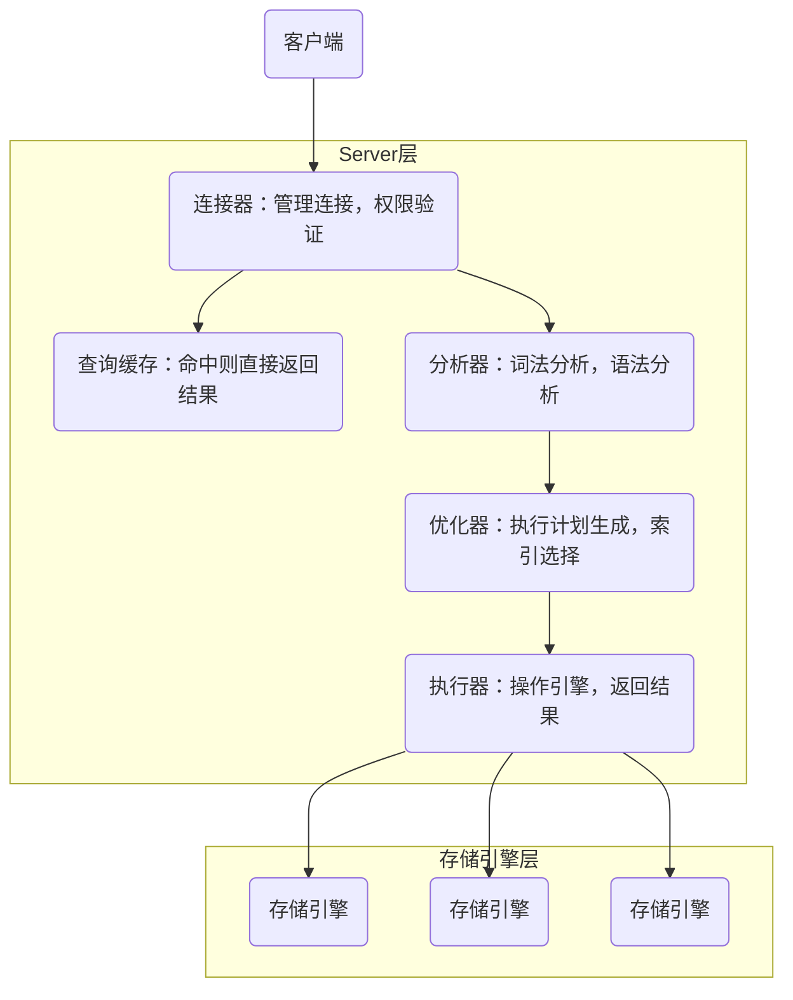
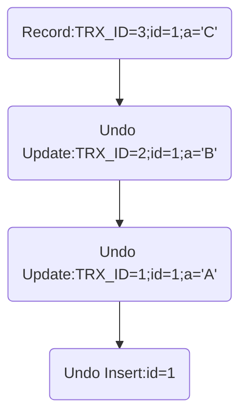

# MySQL高并发业务注意事项

**MySQL是单进程多线程的架构**，通过创建多个线程来服务不同的用户连接，通常情况下随着用户连接数的增加，MySQL内部用于处理用户连接的线程也会同步的增长，在一定范围内增加用户的并发连接，对提高系统的吞吐量有一定的帮助，**然而用户并发连接数超过某个阈值 MySQL 的性能反而会降低**。

##### 用户连接的方式
1. 单线程处理所有的用户连接，一般在调试时使用
2. 多线程处理用户连接，一个线程对应一个用户连接，也是 Mysql 默认连接处理方式
3. 线程池处理用户连接，一个线程对应多个用户连接，比如 MysqlPercona 发行版提供了线程池功能

##### 线程缓存
Mysql 默认的连接处理方式，即一个线程对应一个用户连接。

在某些场景下有一些性能问题，比如大量的短连接，短时间内大量的连接创建和销毁，意味着 Mysql 内部必须要有同样数量的线程创建和销毁。

线程的创建，销毁以及线程上下文切换，会带来严重的性能消耗。因此提出了线程缓存的概念，缓存一定数量的线程来服务用户连接。

用户连接到来，先检查线程缓存中有没有可用的线程，如果没有再去创建，如果有则直接使用线程缓存中的线程，用户连接断开时，线程放回线程缓存中，以便后来的用户连接重用，减少线程频繁创建和销毁。

##### 设置合适的连接数

MySQL 能够处理的最大连接数量由参数 `max_connections` 决定，**最大并发连接数是16384**，默认的最大并发连接配置为`100`

需要在并发连接数、响应时间、内存占用等方面做出平衡，并且要能满足业务的对 SQL 执行的吞吐量和响应时间要求。

如何确定 MySQL 的最大负载和最大并发度？通过压测，不断增加客户端并发数。比如起始客户端并发数为 2，依次递增到 4，8，16，32 等等，每次递增，在没有达到性能瓶颈前，压测的 TPS 会随着客户端并发数的增加而增大，响应时间通常会随着客户端并发数的增加而增加，但是增加的幅度并不明显。

当客户端并发数达到某个阈值时，比如 128，或者 256 甚至更大时，TPS 不再增长，反而出现下降，响应时间则会出现跳跃式的增长，此时则可以认为 MySQL 已经达到了当前配置的最大性能。不同的硬件配置下，MySQL 最大性能的并发连接数也不相同，需要根据具体的环境测试，**一般的原则是最大并发连接数等于 CPU 逻辑核心数的 4 倍**。

此外，如果业务对响应时间有一定的要求，比如业务要求响应时间 50ms，在低于 50ms 的响应时间之内，TPS 越高越好。这时就需要通过压测来确定最合适的并发连接数，在响应时间不超过 50ms 的前提下，不断提高并发数，获取最佳性能。然而不同的机器配置，不同的业务类型，可能会有不同的结果。

#### 执行过程

MySQL 的架构共分为两层：Server 层和存储引擎层。

- Server 层负责建立连接、分析和执行 SQL语句。MySQL 大多数的核心功能模块都在这实现，主要包括连接器，查询缓存、分析器、预处理器、优化器、执行器和binlog等。另外，所有的内置函数（如日期、时间、数学和加密函数等）和所有跨存储引擎的功能（如存储过程、触发器、视图等）都在 Server 层实现。

- 存储引擎层负责数据的存储和提取。支持 InnoDB、MyISAM、Memory 等多个存储引擎，不同的存储引擎共用一个 Server 层。从 MySQL 5.5 版本开始， InnoDB 成为了 MySQL 的默认存储引擎。索引数据结构，就是由存储引擎层实现的。



##### 事务隔离级别
1. 读未提交 (其他改数据的事务尚未提交，自己的事务中也能读到)
2. 读已提交 (其他改数据的事务已经提交，自己的事务中才能读到) **（oracle默认隔离级别）**
3. 可重复读 (其他改数据的事务已经提交，自己的事务中也不去读)**（mysql默认的隔离级别）**
4. 串行化 (自己的事务尚未提交，其他事务不能读数据)

|  事务的隔离级别 |  脏读  | 不可重复读  | 幻读 |
| ------------ | ------------ |------------ |------------ |
| 读未提交  | 可能  | 可能 | 可能  |
| 读已提交  |  不可能  | 可能 | 可能  |
| 可重复读  | 不可能  | 不可能 | 可能  |
| 串行化  | 不可能  | 不可能 | 不可能  |

事务提交过程中 MySQL 进程突然宕机，重启后 MySQL 会先恢复数据再提供服务。

#### WAL 机制
WAL (Write Ahead Log) 技术，也称为日志先行的技术，指的是对数据文件进行修改前必须将修改先记录日志。保证了数据一致性和持久性，并且提升语句执行性能。

MySQL 更改数据的时候之所以不直接写磁盘文件中的数据，最主要就是考虑性能问题。因为直接写磁盘文件是随机写，开销大性能低，没办法满足 MySQL 的高性能要求。所以需要先在内存中对数据进行更改，再异步落盘。但是内存总是不可靠，如果断电重启，还没来得及落盘的内存数据就会丢失，所以还需要加上写日志这个步骤，还能通过日志中的记录进行恢复。

写日志虽然也是写磁盘，但是它是顺序写相比随机写开销更小，能提升语句执行的性能。

##### MVCC (多版本并发控制)
MVCC 全称是 multiversion concurrency control，即多版本并发控制，是 innodb 实现事务并发与回滚的重要功能。

具体的实现是，在数据库的每一行中，添加额外的三个字段：

- DB_TRX_ID – 记录插入或更新该行的最后一个事务的事务 ID
- DB_ROLL_PTR – 指向改行对应的 undolog 的指针
- DB_ROW_ID – 单调递增的行 ID，他就是 AUTO_INCREMENT 的主键 ID

在数据库表中看到的一行记录可能实际上有多个版本，每个版本的记录除了有数据本身外，还有一个表示版本的字段，记为 row trx_id，而这个字段就是其产生的事务的id，它在事务开始的时候向事务系统申请，按时间先后顺序递增。

MVCC和事务结合的核心思想是：一个事务在启动的时候生成一个版本号，如果事务某一个数据的版本号小于当前版本号说明该数据是最新的，可以提交修改；如果该数据版本号大于当前事务版本号，说明事务开启后，该数据已被修改，于是需要查找该数据匹配事务版本号的值。

当发现一条数据的当前版本对当前事务不可见（数据版本号大于当前事务版本号）的时候，MySQL这个时候是不能把这个最新版本的数据返回给客户端的。
1. innodb会通过undo-log数据行的版本号，向上找一个版本。拿到这个版本的ID之后，再次判断这个版本号的数据内容对当前事务是否可见，如果可见则通过undo-log计算出上一个版本的数据内容，然后将数据结果返回。
2. 如果上一个版本的数据仍然不满足对当前事务可见的要求，那么继续查找上一个版本的数据内容。直到找到符合要求的、对当前事务可见的数据版本。然后通过undo-log根据版本号的顺序依次计算出应该返回的数据内容，然后再返回给客户端。

这个通过 undo log + 数据行获取到事务开启时的原始数据的过程就是 “快照读”。很多场景在读取数据库时，需要读取的是行的当前数据，而不需要通过 undo log 回溯到事务开启前的数据状态，就是“当前读”，主要包含以下操作：
```sql
insert update select … lock in share mode 
select … for update
```

> innodb事务日志包括redo log和undo log；redo log是重做日志，提供前滚操作；undo log是回滚日志，提供回滚操作

1. redo log通常是物理日志，记录的是**数据页**的物理修改（不是某一行或某几行的修改），它用来恢复提交后的物理数据页(恢复数据页，且只能恢复到最后一次提交的位置)。

保证了 MySQL 数据一致性和持久性（即使数据刷盘之前 MySQL 宕机，重启后仍然能通过 redo log 里的更改记录进行重放，重新刷盘），此外还能提升语句的执行性能（写 redo log 是顺序写，相比于更新数据文件的随机写，日志的写入开销更小，能显著提升语句的执行性能，提高并发量）

redo log 是固定大小的，所以只能循环写，从头开始写，写到末尾就又回到开头，相当于一个环形。当日志写满了，就需要对旧的记录进行擦除，但在擦除之前，需要确保这些要被擦除记录对应在内存中的数据页都已经刷到磁盘中了。

redo log 写满到擦除旧记录腾出新空间这段期间，不能再接收新的更新请求，所以有可能会导致 MySQL 卡顿（所以针对并发量大的系统，适当设置 redo log 的文件大小非常重要！！！）

2. undo log用来回滚行记录到某个版本。undo log一般是逻辑日志，根据每行记录进行记录。undo log有两个作用：提供回滚和多个行版本控制(MVCC)。

undo log和redo log记录物理日志不一样，它是逻辑日志。可以认为当delete一条记录时，undo log中会记录一条对应的insert记录，反之亦然，当update一条记录时，它记录一条对应相反的update记录。正是依赖 undo log，innodb 实现了 ACID 中的 C – Consistency 即一致性。



3. 归档日志 binlog

binlog 在 MySQL 的 server 层产生，不属于任何引擎，主要记录用户对数据库操作的 SQL 语句（除了查询语句）。之所以将 binlog 称为归档日志，是因为 binlog 不会像 redo log 一样擦掉之前的记录循环写，而是一直记录（超过有效期才会被清理），如果超过单日志的最大值（默认 1G，可以通过变量 max_binlog_size 设置），则会新起一个文件继续记录。

由于日志可能是基于事务来记录的 (如 InnoDB 表类型)，而事务也不能跨文件记录，如果正好 binlog 日志文件达到了最大值但事务还没有提交则不会切换新的文件记录，而是继续增大日志，所以 max_binlog_size 指定的值和实际的 binlog 日志大小不一定相等。

正是由于 binlog 有归档的作用，所以 binlog 主要用作主从同步和数据库基于时间点的还原。


##### 并发写问题
假设事务A执行 update 操作， update 的时候要对所修改的行加行锁，这个行锁会在提交之后才释放。而在事务A提交之前，事务B也想 update 这行数据，于是申请行锁，由于已经被事务A占有，事务B不能得到行锁，此时事务B就会一直处于等待状态，直到事务A提交，事务B才能继续执行，如果事务A的时间太长，那么事务B很有可能出现超时异常。

如果事务中需要锁多个行，要把最可能造成锁冲突、最可能影响并发度的锁的申请时机尽量往后放。

例子：假设实现一个电影票在线交易业务，顾客 A 要在影院 B 购买电影票。这个业务需要涉及到以下操作：

1. 从顾客 A 账户余额中扣除电影票价；

2. 给影院 B 的账户余额增加这张电影票价；

3. 记录一条交易日志。

要完成这个交易，需要 `update` 两条记录，并 `insert` 一条记录。为了保证交易的原子性，要把这三个操作放在一个事务中。如果同时有另外一个顾客 C 要在影院 B 买票，那么这两个事务冲突的部分就是语句 `2` 了。因为它们要更新同一个影院账户的余额，需要修改同一行数据。 根据两阶段锁协议，不论怎样安排语句顺序，所有的操作需要的行锁都是在事务提交的时候才释放的。所以如果把语句 `2` 安排在最后，按照 `3、1、2` 这样的顺序，那么影院账户余额这一行的锁时间就最少。这就最大程度地减少了事务之间的锁等待，提升了并发度。

加锁的过程要分**有索引**和**无索引**两种情况
```
update user set age=11 where id = 1
// id 是这张表的主键，是有索引的情况，那么 MySQL 直接就在索引数中找到了这行数据，然后加上行锁就可以了。
```

```
update user set age=11 where age=10
// 表中并没有为 age 字段设置索引
// MySQL 会为这张表中所有行加行锁
// 在加上行锁后，MySQL 会进行一遍过滤，发现不满足where的行就释放锁，最终只留下符合条件的行
// 虽然最终只为符合条件的行加了锁，但是一锁一释放的过程对性能也是影响极大的
```

##### 高并发事务
1. 结合业务场景，使用低级别事务隔离

在高并发业务中，为了保证业务数据的一致性，操作数据库时往往会使用到不同级别的事务隔离。隔离级别越高，并发性能就越低。

在修改用户最后登录时间的业务场景中，这里对查询用户的登录时间没有特别严格的准确性要求，而修改用户登录信息只有用户自己登录时才会修改，不存在一个事务提交的信息被覆盖的可能。所以允许该业务使用最低隔离级别。

如果是账户中的余额或积分的消费，就存在多个客户端同时消费一个账户的情况，此时应该选择 `RR` 级别来保证一旦有一个客户端在对账户进行消费，其他客户端就不可能对该账户同时进行消费了。

2. 避免行锁升级表锁

在 InnoDB 中，行锁是通过索引实现的，**如果不通过索引条件检索数据，行锁将会升级到表锁**。。

3. 控制事务的大小，减少锁定的资源量和锁定时间长度

 `MySQLQueryInterruptedException: Query execution was interrupted`

由于在抢购提交订单中开启了事务，在高并发时对一条记录进行更新的情况下，由于更新记录所在的事务还可能存在其他操作，导致一个事务时间比较长，当有大量请求进入时，就可能导致一些请求同时进入到事务中。

又因为锁的竞争是不公平的，当多个事务同时对一条记录进行更新时，极端情况下，一个更新操作排队后，可能会一直拿不到锁，最后因超时被系统中断。

例子：在用户购买商品时，首先需要查询库存余额，再新建一个订单，并扣除相应的库存。这一系列操作是处于同一个事务的。 以上业务若是在两种不同的执行顺序下，其结果都是一样的，但在事务性能方面却不一样：

|  执行顺序1 |  执行顺序2  |
| ------------ | ------------ |
| 1.开启事务  |  1.开启事务  |
| 2.查询库存，判断库存是否满足  |  2.查询库存，判断库存是否满足  |
| 3.新建订单  | 3.扣除库存  |
| 4.扣除库存  | 4.新建订单  |
| 5.提交或回滚  | 5.提交或回滚  |

**虽然这些操作在同一个事务，但锁的申请在不同时间，只有当其他操作都执行完，才会释放所有锁**。

因为扣除库存是更新操作，属于行锁，这将会影响到其他操作该数据的事务，所以应该尽量避免长时间地持有该锁，尽快释放该锁。

又因为先新建订单和先扣除库存都不会影响业务，所以可以将扣除库存操作放到最后，也就是使用执行顺序 `1`，以此尽量减小锁的持有时间。

