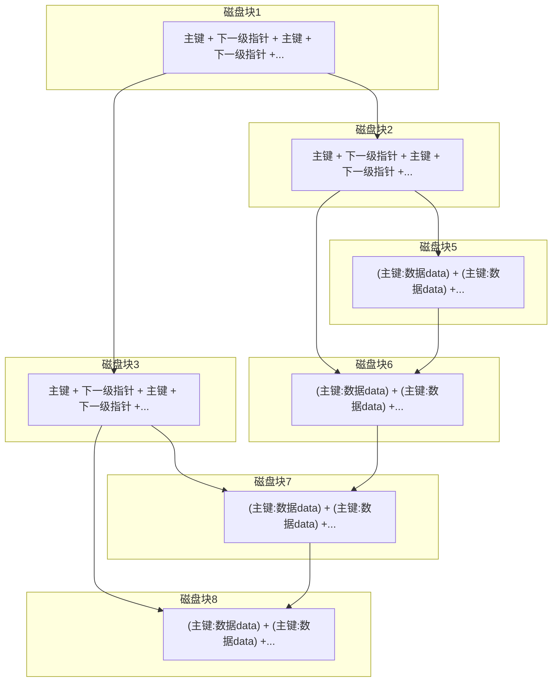

# MySql大数据深度分页查询慢

#### 解决方案：索引排序+索引覆盖+延迟关联

查询语句：
```sql
select * from user order by  createTime limit 500000, 10;
```

 延迟关联，即先查主键 id，然后根据 id 查其它字段：
 ```sql
 select * from user u,(select id from user order by createTime  limit 500000, 10) t where u.id=t.id;
 ```

#### 原理分析
随着 mysql limit 的值越来越大，查询可能变慢；慢的真正原因，不是因为扫描了 500000 行，而在于把这 500000 行数据重新排序。

```sql
explain select * from user order by  createTime limit 500000, 10;
```
分析结果：
| id | select_type | table | type | possible_keys | key | key_len | ref | rows | Extra |
| --- | ---------- | ----- | ---- | ------------- | --- | ------- | --- | --- | ---- |
| 1 | SIMPLE | user | ALL | null | null | null | null | 6166727| Using filesort |

索引的功能： 排序/查找/锁

索引中的数据已经排好序，如果从索引中拿到的数据顺序跟我们需要排序的顺序是一致的，就不要重新排序了。

解决`Using filesort`需要给`order by`字段增加索引或者使用已有索引的字段
```sql
-- 使用主键索引耗时明显减少
select * from user order by  id limit 500000, 10;  
--270ms
```

#### 延迟关联
先拿到主键 id，然后再根据 id 查询 select *
```sql
explain select * from user order by  id limit 500000, 10;
```
分析结果：
| id | select_type | table | type | possible_keys | key | key_len | ref | rows | Extra |
| --- | ---------- | ----- | ---- | ------------- | --- | ------- | --- | --- | ---- |
| 1 | SIMPLE | user | index | null | PRIMARY | 8 | null | 500010 | Using index |

 Extra 的中 `Using index` 就表示“覆盖索引”，表示整个查询过程仅读取了索引中的数据而没有回表查询。
```sql
select * from user u,(select id from user order by id limit 500000, 10)  t where u.id=t.id; 
--83ms
```

#### 索引覆盖
mysql B+树索引：主键索引叶子节点存的是主键所对应行的整行的全量数据，所有叶子节点按顺序链接，提高范围查询效率



索引覆盖查询
```sql
select * from user order by id limit 500000, 10;  --305ms  all
select id from user order by id limit 500000, 10;  --99ms   index
```
全表扫描0.3s, 索引覆盖0.1s

重排序查询
```sql
select * from user order by createTime limit 500000, 10;  --999ms  all filesort
```
使用非索引字段排序0.9s


