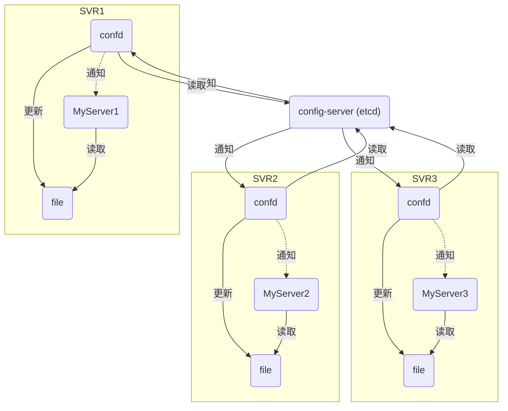
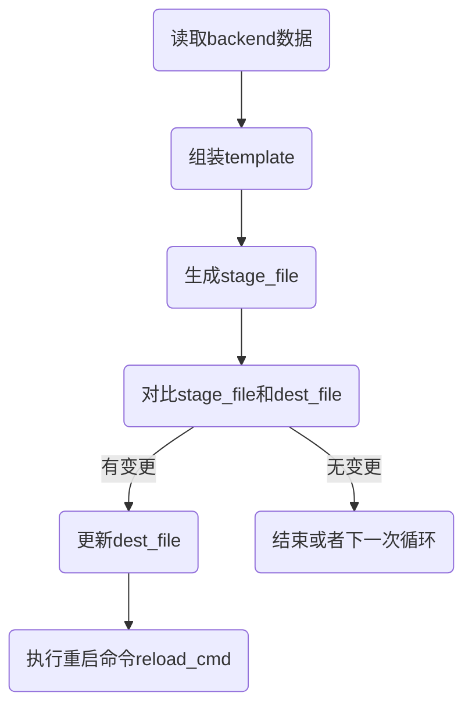
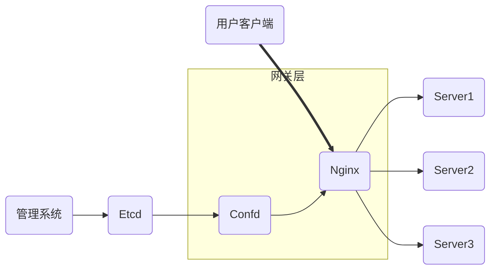

# Nginx使用Confd实现配置管理

Confd是一个轻量级的配置管理工具。通过查询后端存储etcd，redis，consul等，一方面结合配置模板引擎，保持本地配置最新；一方面具备定期探测机制，配置变更自动下发check和reload。

#### 安装
https://github.com/kelseyhightower/confd

https://github.com/etcd-io/etcd

#### 使用场景


#### confd工作原理

- confd配置文件默认在`/etc/confd`中，可以通过参数`-confdir`指定。目录中包含两个子目录，分别是：`conf.d` 存放.toml配置文件和 `templates`存放.tmpl配置模版文件。
- confd会先读取`conf.d`目录中的配置文件(toml格式)，然后根据文件指定的模板路径去渲染模板，再执行`check_cmd`和`reload_cmd`。

#### 服务启动
confd支持以`daemon`或者`onetime`两种模式运行

- onetime模式：只会生成一次配置，之后key无论变化不会再生成
```sh
confd -onetime -backend etcdv3 -node http://127.0.0.1:2379
```
- daemon模式：动态监听后端存储的配置变化，根据配置模板动态生成目标配置文件
```sh
confd -watch -backend etcdv3 -node http://127.0.0.1:2379
```

#### 配置实例
架构图


1. confd创建配置文件
```sh
cat /etc/confd/conf.d/test.conf.toml

[template]
prefix = "/nginx" # 指定前缀便于区分不同confd项目
src = "test.conf.tmpl" # 配置模板相对路径
dest = "/etc/nginx/conf.d/test.conf" # 目标路径
mode = "0664" # 文件权限
keys = [ # 键数组，与模板文件使用的键对应
  "/nginx_test"
] 
check_cmd = "/usr/sbin/nginx -t -c {{.src}}" # 配置检查命令
reload_cmd = "/usr/sbin/nginx -s reload" # 重启nginx服务
```
2. confd创建模板文件
```sh
cat templates/test.conf.tmpl

upstream www_{{getv "/nginx/www/server/server_name"}} {   
  {{range getvs "/nginx/www/upstream/*"}}       
    server {{.}};  
  {{end}}
}
server { 
  server_name {{getv "/nginx/www/server/server_name"}};  
  location / {       
    proxy_pass http://www_{{getv "/nginx/www/server/server_name"}};     proxy_set_header Host $host;  
    proxy_set_header X-Real-IP $remote_addr;  
    proxy_set_header X-Forwarded-For $proxy_add_x_forwarded_for;   
    proxy_set_header X-Forwarded-Proto https;     
    proxy_redirect   off;  
  }
}

```

3. etcd存储具体配置项
```sh
etcdctl set /nginx/https/www/server/server_name test.com
etcdctl set /nginx/https/www/upstream/server1 192.168.1.110
etcdctl set /nginx/https/www/upstream/server2 192.168.1.111
```

4. confd监听etcd配置
```sh
confd -watch -backend etcdv3 -node http://127.0.0.1:2379
```

5. 查看confd生成的nginx配置文件
```sh
 cat /etc/nginx/conf.d/test.conf
 
 upstream www_test.com{        
    server 192.168.1.110;        
    server 192.168.1.111;
 }
 server {   
    server_name test.com;    
    location / {        
      proxy_pass  http://www_test.com;        
      proxy_set_header Host $host;        
      proxy_set_header X-Real-IP $remote_addr;      
      proxy_set_header X-Forwarded-For $proxy_add_x_forwarded_for;      
      proxy_set_header X-Forwarded-Proto https;        
      proxy_redirect   off;    
    }
 }

 ```
通过Etcd和Confd来实现nginx upstream的动态更新，简单实现了服务器的灰度发布功能。
