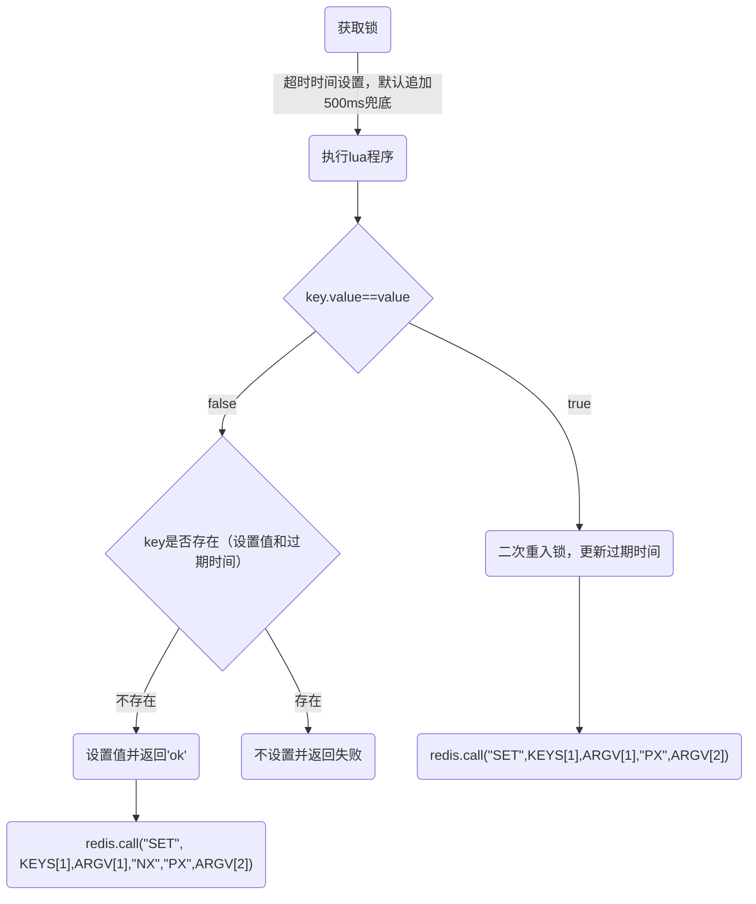
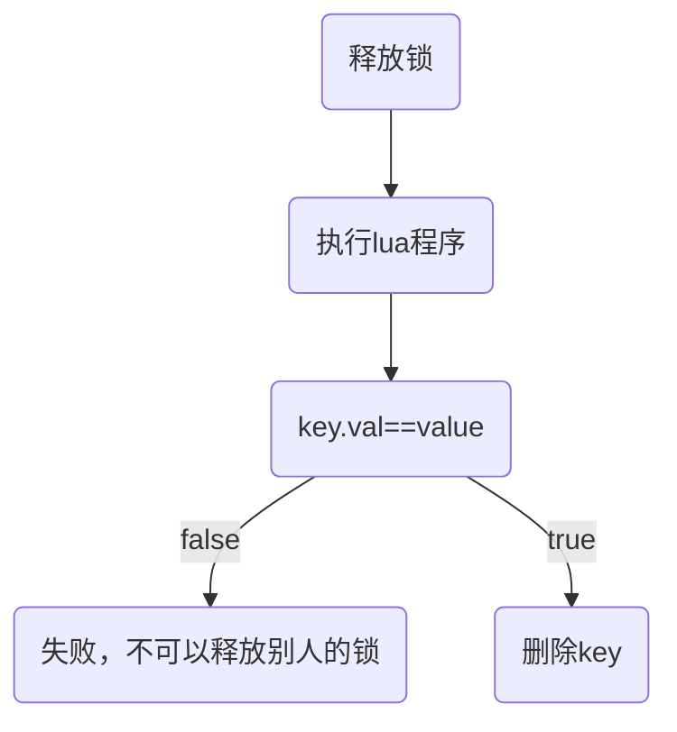

# Redis分布式锁

#### 应用场景
- 用户下单
锁住 uid，防止重复下单。

- 库存扣减
锁住库存，防止超卖。

- 余额扣减
锁住账户，防止并发操作。

分布式系统中共享同一个资源时往往需要分布式锁来保证变更资源一致性。

#### 分布式锁特性
- 排他性
锁的基本特性，并且只能被第一个持有者持有。

- 防死锁
高并发场景下临界资源一旦发生死锁非常难以排查，通常可以通过设置超时时间到期自动释放锁来规避。

- 可重入
锁持有者支持可重入，防止锁持有者再次重入时锁被超时释放。

- 高性能高可用
锁是代码运行的关键前置节点，一旦不可用则业务直接就报故障了。高并发场景下，高性能高可用是基本要求。

#### Redis分布式锁
- set 命令
```sh
SET key value [EX seconds] [PX milliseconds] [NX|XX]

# EX second：设置键的过期时间为 second 秒；SET key value EX second 效果等同于 SETEX key second value
# PX millisecond：设置键的过期时间为 millisecond 毫秒；SET key value PX millisecond 效果等同于 PSETEX key millisecond value
# NX：只在键不存在时，才对键进行设置操作；SET key value NX 效果等同于 SETNX key value
# XX：只在键已经存在时，才对键进行设置操作
```

- Redis.lua
使用 redis lua 程序能将一系列命令操作封装成 `pipline` 实现整体操作的原子性。

go-zero 分布式锁 `RedisLock` 源码分析`core/stores/redis/redislock.go`

1. 加锁流程
```lua
-- KEYS[1]: 锁key
-- ARGV[1]: 锁value,随机字符串
-- ARGV[2]: 过期时间
-- 判断锁key持有的value是否等于传入的value
-- 如果相等说明是再次获取锁并更新获取时间，防止重入时过期
-- 这里说明是"可重入锁"

if redis.call("GET", KEYS[1]) == ARGV[1] then
    -- 设置
    redis.call("SET", KEYS[1], ARGV[1], "PX", ARGV[2])
    return "OK"

else
    -- 锁key.value不等于传入的value则说明是第一次获取锁
    -- SET key value NX PX timeout: 当key不存在时才设置key的值
    -- 设置成功会自动返回"OK"，设置失败返回"NULL Bulk Reply"
    -- 为什么这里要加"NX"呢，因为需要防止把别人的锁给覆盖了
    return redis.call("SET", KEYS[1], ARGV[1], "NX", "PX", ARGV[2])
end
```



2. 解锁流程
```lua
-- 释放锁
-- 不可以释放别人的锁
if redis.call("GET", KEYS[1]) == ARGV[1] then
    -- 执行成功返回"1"
    return redis.call("DEL", KEYS[1])
else
    return 0
end
```



3. 源码解析
```go
package redis

import (
    "math/rand"
    "strconv"
    "sync/atomic"
    "time"

    red "github.com/go-redis/redis"
    "github.com/zeromicro/go-zero/core/logx"
)

const (
    letters     = "abcdefghijklmnopqrstuvwxyzABCDEFGHIJKLMNOPQRSTUVWXYZ"
    lockCommand = `if redis.call("GET", KEYS[1]) == ARGV[1] then
    redis.call("SET", KEYS[1], ARGV[1], "PX", ARGV[2])
    return "OK"
else
    return redis.call("SET", KEYS[1], ARGV[1], "NX", "PX", ARGV[2])
end`
    delCommand = `if redis.call("GET", KEYS[1]) == ARGV[1] then
    return redis.call("DEL", KEYS[1])
else
    return 0
end`
    randomLen = 16
    // 默认超时时间，防止死锁
    tolerance       = 500 // milliseconds
    millisPerSecond = 1000
)

// A RedisLock is a redis lock.
type RedisLock struct {
    // redis客户端
    store *Redis
    // 超时时间
    seconds uint32
    // 锁key
    key string
    // 锁value，防止锁被别人获取到
    id string
}

func init() {
    rand.Seed(time.Now().UnixNano())
}

// NewRedisLock returns a RedisLock.
func NewRedisLock(store *Redis, key string) *RedisLock {
    return &RedisLock{
        store: store,
        key:   key,
        // 获取锁时，锁的值通过随机字符串生成
        // 实际上go-zero提供更加高效的随机字符串生成方式
        // 见core/stringx/random.go：Randn
        id:    randomStr(randomLen),
    }
}

// Acquire acquires the lock.
// 加锁
func (rl *RedisLock) Acquire() (bool, error) {
    // 获取过期时间
    seconds := atomic.LoadUint32(&rl.seconds)
    // 默认锁过期时间为500ms，防止死锁
    resp, err := rl.store.Eval(lockCommand, []string{rl.key}, []string{
        rl.id, strconv.Itoa(int(seconds)*millisPerSecond + tolerance),
    })
    if err == red.Nil {
        return false, nil
    } else if err != nil {
        logx.Errorf("Error on acquiring lock for %s, %s", rl.key, err.Error())
        return false, err
    } else if resp == nil {
        return false, nil
    }

    reply, ok := resp.(string)
    if ok && reply == "OK" {
        return true, nil
    }

    logx.Errorf("Unknown reply when acquiring lock for %s: %v", rl.key, resp)
    return false, nil
}

// Release releases the lock.
// 释放锁
func (rl *RedisLock) Release() (bool, error) {
    resp, err := rl.store.Eval(delCommand, []string{rl.key}, []string{rl.id})
    if err != nil {
        return false, err
    }

    reply, ok := resp.(int64)
    if !ok {
        return false, nil
    }

    return reply == 1, nil
}

// SetExpire sets the expire.
// 需要注意的是需要在Acquire()之前调用
// 不然默认为500ms自动释放
func (rl *RedisLock) SetExpire(seconds int) {
    atomic.StoreUint32(&rl.seconds, uint32(seconds))
}

func randomStr(n int) string {
    b := make([]byte, n)
    for i := range b {
        b[i] = letters[rand.Intn(len(letters))]
    }
    return string(b)
}
```

