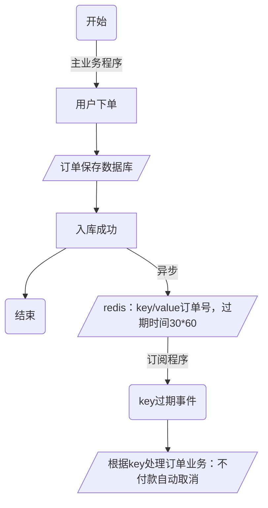

# Redis实现延时任务-keyspace

> 在 Redis 2.8.0 版本起加入了 "Keyspace notifications"（即 "键空间通知"）的功能。

键空间通知使得客户端可以通过发布订阅特定通道 (Redis 自带) 来接收那些以某种方式改动了 Redis 数据集的事件。Redis 目前的订阅与发布功能采取的是**发送即忘策略**，如果订阅事件的客户端断开连接后再次连接上的时候，它会丢失所有在断开连接期间分发给它的事件。**所以如果项目程序需要可靠事件通知， 那么目前的键空间通知可能并不适合。**

#### 实现原理
对于每个修改数据库的操作，键空间通知都会发送两种不同类型的事件消息：`keyspace` 和 `keyevent`。

举例：对 `0` 号数据库的键 `sampleKey` 执行 `DEL` 命令时， 系统将分发两条消息， 相当于执行以下两个 `PUBLISH` 命令：
```
PUBLISH __keyspace@0__:sampleKey del
PUBLISH __keyevent@0__:del sampleKey
```

订阅第一个频道`__keyspace@0__:sampleKey` 可以接收 `0` 号数据库中所有修改键 `sampleKey` 的事件；订阅第二个频道 `__keyevent@0__:del` 则可以接收 `0` 号数据库中所有执行 `del` 命令的键。

以 `keyspace` 为前缀的频道被称为键空间通知（key-space notification）， 而以 `keyevent` 为前缀的频道则被称为键事件通知（key-event notification）。

事件是用 `keyspace@DB:KeyPattern` 或者 `keyevent@DB:OpsType` 的格式来发布消息的。
- DB 表示在第几个库；
- KeyPattern 则是表示需要监控的键模式（可以用通配符，如：key*）；
- OpsType 则表示操作类型。

#### 修改配置

因为开启键空间通知功能需要消耗一些 CPU ， 所以在默认配置下 `notify-keyspace-events` 选项的参数为空字符串，该功能处于关闭状态。

`notify-keyspace-events` 的参数可以是以下字符的任意组合， 它指定了服务器该发送哪些类型的通知： 
| 字符 | 通知类型 |
| --- | --- |
| K | 键空间通知，所有通知以keyspace@为前缀，针对key |
| E | 键事件通知，所有通知以keyevent@为前缀，针对event |
| g | DEL/EXPIRE/RENAME等类型无关的通用命令的通知 |
| $ | 字符串命令的通知 |
| l | 列表命令的通知 |
| s | 集合命令的通知 |
| h | 哈希命令的通知 |
| z | 有序集合命令的通知 |
| x | 过期事件：每当有过期键被删除时发送 |
| e | 驱逐(evict)事件：每当有键因为maxmemory政策而被删除时发送 |
| A | 参数g$lshzxe的别名， 相当于all |

配置参数中至少要有一个 `K` 或者 `E` ， 否则不管其余的参数是什么， 都不会有任何通知被分发。
```sh
notify-keyspace-events Ex
```

修改配置后，重启 redis 服务。

#### 终端测试

开启一个终端，订阅 `0` 数据库所有 key 存储时间过期的事件，阻塞等待接收消息。
```sh
redis-cli
127.0.0.1:6379> psubscribe __keyevent@0__:expired
Reading messages... (press Ctrl-C to quit)
1) "psubscribe"
2) "__keyevent@0__:expired"
3) (integer) 1
```

再开启一个终端，新增一个 20 秒过期的 key：
```sh
127.0.0.1:6379> SETEX test 123 20
OK
```

观察订阅 key 存储时间过期事件的终端，20 秒过期后有如下信息输出：
```sh
1) "pmessage"
2) "__keyevent@0__:expired"
3) "__keyevent@0__:expired"
4) "test"
```
说明对过期 Key 事件信息的订阅是成功的。

#### golang 测试代码
```go
package main

import (
    "fmt"
    "github.com/gomodule/redigo/redis"
    "strconv"
    "time"
    "unsafe"
)


type PSubscribeCallback func (pattern, channel, message string)

type PSubscriber struct {

    client redis.PubSubConn

    cbMap map[string]PSubscribeCallback
}

func PConnect(ip string, port uint16, password string) redis.Conn {
    conn, err := redis.Dial("tcp", ip + ":" + strconv.Itoa(int(port)))
    if err != nil {
        print("redis dial failed.")
    }
    conn.Do("AUTH",password)
    return conn
}

func (c *PSubscriber) ReceiveKeySpace(conn redis.Conn) {
    c.client = redis.PubSubConn{conn}
    c.cbMap = make(map[string]PSubscribeCallback)
    go func() {
        for {
            switch res := c.client.Receive().(type) {
            case redis.Message:
                pattern := &res.Pattern
                channel := &res.Channel
                message := (*string)(unsafe.Pointer(&res.Data))
                c.cbMap[*channel](*pattern, *channel, *message)
            case redis.Subscription:
                fmt.Printf("%s: %s %d\n", res.Channel, res.Kind, res.Count)
            case error:
                print("error handle...")
                continue
            }
        }
    }()
}

const expired = "__keyevent@0__:expired"

func (c *PSubscriber)Psubscribe() {
    // 订阅__keyevent@0__:expired事件【相当于命令PSUBSCRIBE __keyevent@0__:expired】，当事件发生时调用PubCallback函数
    err := c.client.PSubscribe(expired)
    if err != nil{
        print("redis Subscribe error.")
    }
    c.cbMap[expired] = PubCallback
}

func PubCallback(patter , channel, msg string){
    print( "PubCallback patter : " + patter + " channel : ", channel, " message : ", msg)
    // TODO:拿到msg后进行后续的业务代码，例如订单的取消或者其他延时处理
}

func main() {

    var sub PSubscriber
    conn := PConnect("192.168.11.213", 6379,"")
    sub.ReceiveKeySpace(conn)
    sub.Psubscribe()
    for{
        time.Sleep(time.Second)
    }
}
```
```sh
# 启动监听端
$ go run redis-delay.go

2022/09/08 16:03:54.563 [D]  wait...
__keyevent@0__:expired: psubscribe 1
```
```sh
# 在 redis 添加超时 key/value 数据
127.0.0.1:6379> set ID19000101 123 ex 5
OK
```
```sh
# 监听结果
2022/09/08 16:03:54.563 [D]  wait...
__keyevent@0__:expired: psubscribe 1
2022/09/08 16:03:54.564 [D]  wait...
2022/09/08 16:04:22.966 [D]  PubCallback patter : __keyevent@0__:expired channel :  __keyevent@0__:expired  message :  ID19000101
2022/09/08 16:04:22.966 [D]  wait...
```

#### 注意事项
- 过期事件
key 过期事件的触发时机是在过期 key 被 redis 回收时才会触发 `expired` 消息推送。即 redis 的这个 keyspace notifications 功能也**无法保证百分的实时性**（具体原因可查考 redis 的回收机制 GC）。如果 key 不是特别多的时候，这个延时也是可以接受的。

- 事件丢失
当监听端断开后，redis 事件仍然会持续推送（监听端丢失），当监听端重新监听后丢失消息 redis 不会重新推送。如果需要做持久化可能还需要依赖于其他服务，例如：mysql 等。

- 业务场景
1. 有一个养殖类游戏，通过给养的宠物喂食来升级，一次喂食后宠物需要花 4 个小时吃完。现在有个新需求，可以使用道具卡来丰富玩法。道具卡有两种，一种是加速卡，一种是自动喂食卡。加速卡会使吃食的时间缩短两个小时，自动喂食卡可以在宠物吃完当前喂食的狗粮后系统帮助其自动喂食一次。自动喂食就是一种典型的延时任务。延时任务是指需要在指定的未来的某个时间点自动触发。

2. 活动结束前 2 小时给用户推送消息；优惠券过期前 2 小时给用户推送消息；

3. 秒杀时，下单后 10 分钟内未付款就自动取消订单等


    
