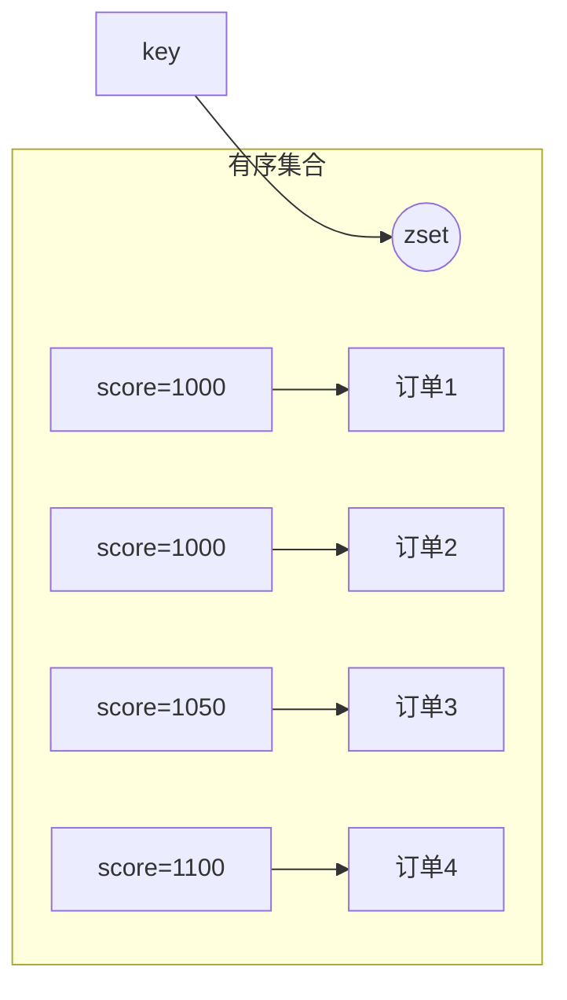
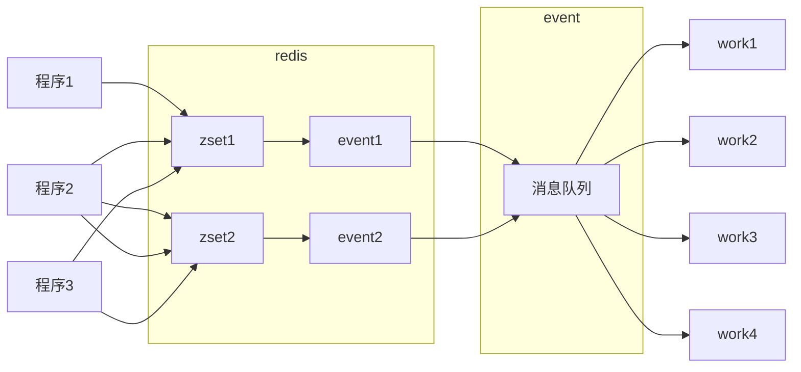

# Redis实现延时任务-zset

redis 的 `ZSET` 会储存一个 `score` 和一个 `value`，可以将 `value` 按照 `score` 进行排序。

redis 的 `ZSET` 是通过**跳跃表**来实现的，复杂度为 `O (logN)`，N 是存放在 ZSET 中元素的个数。可以依赖于 redis 自身的持久化来实现持久化，redis 的集群来支持高并发和高可用。整个数据处理过程延时较小。

#### 相关命令
1. Redis `ZADD` 命令将一个或多个 member 元素及其 score 值加入到有序集 key 当中。

如果某个 member 已经是有序集的成员，那么更新这个 member 的 `score` 值，并通过重新插入这个 member 元素，来保证该 member 在正确的位置上。
```sh
ZADD key [NX|XX] [CH] [INCR] score member [score member ...]
// 返回被成功添加的新成员的数量，不包括那些被更新的，或者已经存在的成员。
```



2. Redis `ZRANGEBYSCORE` 命令返回有序集合 key 中，所有 `score` 值介于 `min` 和 `max` 之间 (包括等于 `min` 或 `max`) 的成员。有序集成员按 `score` 值递增 (从小到大) 顺序排列。
```sh
ZRANGEBYSCORE key min max [WITHSCORES] [LIMIT offset count]
// 指定区间内，带有 `score` 值(可选)的有序集成员的列表。
```
可选参数 `LIMIT` 指定返回结果的数量及区间 (就像 SQL 中的 `SELECT LIMIT offset, count`)，注意当 `offset` 很大时，定位 `offset` 的操作可能需要遍历整个有序集，此过程最坏复杂度为 `O (N)` 时间。

无限区间：`min` 和 `max` 也可以是 `-inf` 和 `+inf` ，可以在不知道有序集的最低和最高 `score` 值的情况下，使用 ZRANGEBYSCORE 命令。

默认情况下，区间的取值使用闭区间 (小于等于或大于等于)，通过给参数前增加 (符号来使用可选的开区间，也就是小于或大于。示例如下：
```sh
ZRANGEBYSCORE zset (1 10    #表示 1<score<=10
ZRANGEBYSCORE zset (5 (20   #1<score<20
```

查询 zset 的 `score` 分数最小的元素，可以用 `ZRANGEBYSCORE key -inf +inf limit 0 1 withscores` 命令来实现。

3. Redis `ZREM` 命令移除有序集 key 中的一个或多个成员，不存在的成员将被忽略。当 key 存在但不是有序集类型时，返回一个错误。
```sh
ZREM key member [member ...]
// 被成功移除的成员的数量，不包括被忽略的成员。
```

#### 实现原理
延时任务的实现分为以下几步来实现：

1. 将任务的执行时间作为 `score`（订单生成时间 + 延时时长），要执行的任务数据作为 `value`（如：订单编号），存放在 zset 中；

2. 启动一个进程定时查询 zset 的 `score` 分数小于等于当前时间戳的延时任务并执行；可以用 `ZRANGEBYSCORE key 0 当前时间戳 [WITHSCORES] [LIMIT offset count]` 命令来实现；

3. 然后删除 zset 的这些任务。



一个 `key` 存储的数据量变多以后，导致查询速度变慢，因为其时间复杂度为 `O (logN)`；其次如果在同一个时间点有多个任务时，一个 `key` 会分发造成拥堵。因此，设计为**多个** `key` 来存储，通过 `uuid` 进行 `hash` 路由到对应的 `key` 中，如果任务量增长，可以快速扩容 redis key 的数量来扛住增长的数量；

建立与多个 `key` 相同的进程或者线程数，每个 `event` 进程一个编号分别对应一个 `key`，不断轮询相应的 `key`；`event` 进程只查询出任务，但是不处理业务，将该任务写入到消息队列，然后删除 zset 的这些任务，另外有 `work` 消费者取消息然后执行业务。这样 `work` 进行可以分布式部署，`event` 只需做分发，提高并发效率，即使同一时间有大量的任务，也能在很小的延时内完成任务。当然如果任务量小也可以不用消息队列直接在 `event` 处理任务。

可扩展部分：
1. 如果`event` 进程单机部署，在机器宕机后导致无法取消息，redis 储存的数据还会被积压。可以多机部署 `event` 进程并使用 `zookeeper` 或者 `etcd` 选主，只有 `leader` 主机上的进程才从 redis 取消息。`leader` 主机宕机后会自动选择新的 leader

2. 在实际的业务中还存在 `DB` 写入数据的业务。延时任务产生是先修改 `DB` 然后再向 `redis` 写入数据，那么就存在 DB 更新成功，然后 redis 写失败的场景，这种情况首先是通过重试来减少 redis 写入失败的概率，如果重试任然不能成功，就发送一条消息给其他进程进行异步补偿

