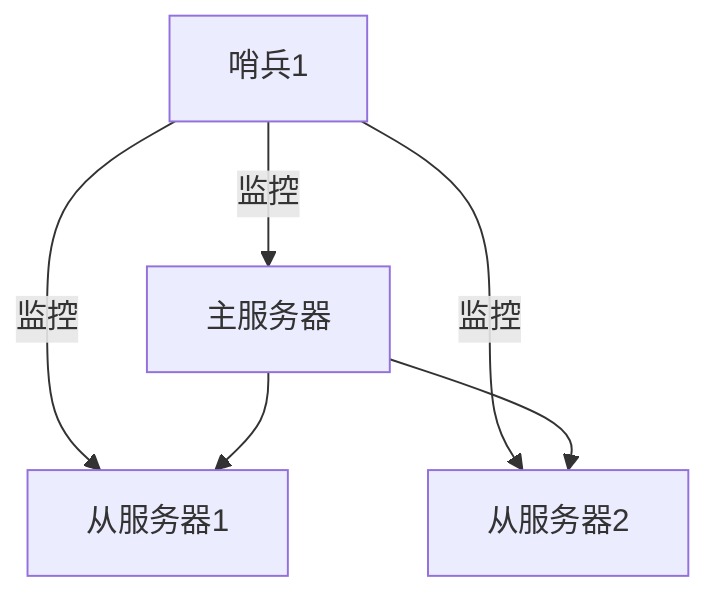
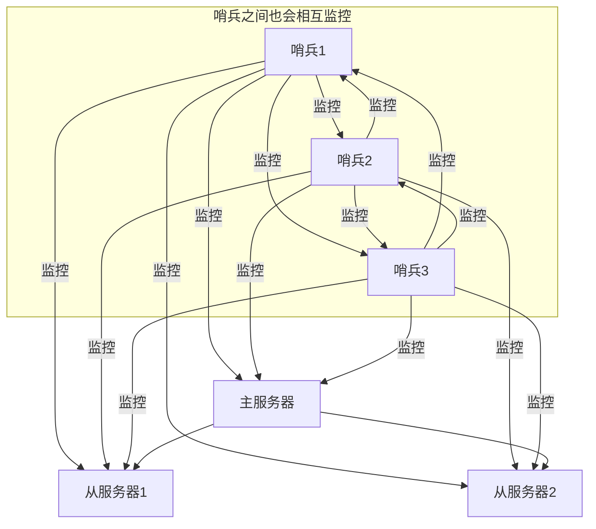

# Redis集群-哨兵模式

#### 架构原理
Sentinel（哨岗、哨兵）是Redis的主从架构的高可用解决方案：由一个或多个Sentinel实例（instance）组成的Sentinel系统监视任意多个Redis主节点，以及这些主节点下的所有从节点；当主节点进入下线状态时，自动将该主节点的从节点晋升为主节点，然后由新的主节点继续处理命令请求，从而达到高可用的目的。

哨兵模式是一种特殊的模式，Redis 为其提供了专属的哨兵命令，它是一个独立的进程，能够独立运行。其基本原理是：**哨兵通过发送命令，等待Redis服务器响应，从而监控运行的多个Redis实例。**

1. 哨兵节点会每秒钟对每个Redis节点发送Ping命令，并通过Redis节点的回复来判断其运行的状态。
2. 当哨兵检测到主服务器发生故障时，会自动在从节点中选择一台服务器，将其提升为主服务器，然后使用PubSub订阅模式通知其他的从节点修改自身配置文件跟随新的主服务器。



#### 多哨兵模式

> 在实际生产中，哨兵是集群的高可用的保障；为避免一个哨兵节点发生故障；它一般是由3-5个节点组成；并且各个哨兵节点之间还会互相进行监控；这样就算挂了个别节点该集群仍然可以正常运转。



1. 主观下线

主观下线适用于主服务器和从服务器。如果在规定的时间内(配置参数down-after-milliseconds)Sentinel节点没有收到目标服务器的有效回复，则判定该服务器为主观下线。例 Sentinel1 向主服务发送了PING 命令；在规定时间内没收到主服务器PONG回复；则 Sentinel1 判定主服务器为“主观下线”；这个时候系统并不会马上进行failover过程；因为仅仅是Sentinel1主观的认为主服务器不可用。

2. 客观下线

客观下线，只适用于主服务器。 Sentinel1 发现主服务器出现了故障，它会通过相应的命令，询问其它 Sentinel 节点对主服务器的状态判断。如果过半数以上Sentinel 节点认为主服务器 down 掉，则 Sentinel1 节点判定主服务为"客观下线”。

3. 投票选举

所有 Sentinel 节点会通过投票机制，按照谁发现谁去处理的原则，选举 Sentinel1 为领头节点去做 Failover（故障转移）操作。Sentinel1 节点则按照一定的规则在所有从节点中选择一个最优的作为主服务器，然后通过发布订阅功能通知其余的从节点（slave）更改配置文件，跟随新上任的主服务器（master）。至此就完成了主从切换的操作。

4. 工作流程

（1）Sentinel 负责监控主从节点的“健康”状态。当主节点挂掉时，自动选择一个最优的从节点切换为主节点。

（2）客户端来连接 Redis 集群时，会首先连接 Sentinel，通过 Sentinel 来查询主节点的地址，然后再去连接主节点进行数据交互。

（3）当主节点发生故障时，客户端会重新向 Sentinel 要地址，Sentinel 会将最新的主节点地址告诉客户端。因此应用程序无需重启即可自动完成主从节点切换。

哨兵对监控主节点会定期的向主节点发送PING命令获取主节点的状态，如果迟迟获取不到该主节点信息就会认为该主节点可能发生了故障【主观下线】，进而通过__sentinel__:hello通道向其他哨兵节点发送信息；其他哨兵节点从该通道获取到信息之后，就会向主节点发送PING命令，进行再次验证；如果多个哨兵节点都无法联系到该主节点，该主节点被认定是发生了故障【客观下线】。

当然不论是主节点还是从节点，哨兵都会对其进行监控，一旦发现主观下线就标记为SDOWN，客观下线则标记为ODOWN。

哨兵在选择从节点为主节点的时候，必须满足该节点是非故障【非下线】的；优先考虑从节点配置的优先级【slave-priority】；最后考虑复制的进度【slave_repl_offset数据偏移量最大】。


#### 集群搭建
哨兵模式是建立在主从模式之上的，需要先行搭建redis的主从模式。

1. 配置文件
新建配置文件redis-sentinel.conf
```
port 26379 # sentinel 端口，默认为26379
sentinel monitor myredis 127.0.0.1 6379 1

# sentinel monitor <master-name> <ip> <port> <quorum>
# <master-name> 主服务器名称
# <ip> 主服务器ip
# <port> 主服务器port
# <quorum> 是一个数字，表示当有多少个 sentinel 认为主服务器宕机时，它才算真正的宕机掉，例如写2，那么表示只有两个或两个以上的哨兵认为主服务器不可用的时候，才会进行failover操作。通常数量为半数或半数以上才会认为主机已经宕机， quorum需要根据 sentinel 的数量配置。
```
具体参数配置可以参考文档 https://redis.io/docs/management/sentinel/

2. 启动哨兵
```
redis-sentinel /path/to/sentinel.conf
# 或者
redis-server /path/to/sentinel.conf --sentinel

```
如果单个监听服务器需要启动多个哨兵，可以配置多个sentinel.conf文件
-  哨兵1：
```
port 26379
sentinel monitor myredis 127.0.0.1 6379 2
```
- 哨兵2：
```
port 26380
sentinel monitor myredis 127.0.0.1 6379 2
```
由于quorum设置为2，所以只有两个哨兵都发现主机宕机了才会进行重新选举。

```
# 主要配置说明：

sentinel monitor mymaster 127.0.0.1 6379 2
sentinel down-after-milliseconds mymaster 60000 # 在指定的毫秒数内若主节点没有应答哨兵的 PING 命令，此时哨兵认为服务器主观下线，默认时间为 30 秒。
sentinel failover-timeout mymaster 180000 # 指定故障转移允许的毫秒数，若超过这个时间就认为故障转移执行失败，默认为 3 分钟。
sentinel parallel-syncs mymaster 1 # 指定可以有多少个 Redis 服务同步新的主机，一般而言这个数字越小同步时间越长，而越大则对网络资源要求就越高。
sentinel notification-script mymaster /var/redis/notify.sh #配置当某一事件发生时所需要执行的脚本，可以通过脚本来通知管理员，例如当系统运行不正常时发邮件通知相关人员。
#若脚本执行后返回1，那么该脚本稍后将会被再次执行，重复次数目前默认为10
#若脚本执行后返回2，或者比2更高的一个返回值，脚本将不会重复执行。
#如果脚本在执行过程中由于收到系统中断信号被终止了，则同返回值为1时的行为相同。#一个脚本的大执行时间为60s，如果超过这个时间，脚本将会被一个SIGKILL信号终止，之后重新执行。
```

#### 哨兵缺点

集群容量到达上限以后，不易在线扩容。Redis 哨兵模式基本已经可以实现高可用和读写分离 ，但是在这种模式下每台 Redis 服务器都存储相同的数据，很浪费内存。Cluster 集群模式实现了 Redis 的分布式存储，对数据进行分片，也就是说每台 Redis 节点上存储不同的内容，每个节点都会通过集群总线(cluster bus)与其他的节点进行通信。

#### golang连接服务器客户端
https://redis.uptrace.dev/zh/guide/go-redis-sentinel.html
从go-redis v8版本开始，你可以尝试使用 NewFailoverClusterClient 把只读命令路由到从节点， 请注意， NewFailoverClusterClient 借助了 Cluster Client 实现，不支持DB选项（只能操作DB 0）
```
import "github.com/redis/go-redis/v9"

rdb := redis.NewFailoverClusterClient(&redis.FailoverOptions{
    MasterName:    "master-name",
    SentinelAddrs: []string{":9126", ":9127", ":9128"},

    // 你可以选择把只读命令路由到最近的节点，或者随机节点，二选一
    // RouteByLatency: true,
    // RouteRandomly: true,
})
```

#### golang哨兵服务器客户端
请注意，哨兵客户端本身用于连接哨兵服务器，你可以从哨兵上获取管理的redis服务器信息
```
import "github.com/redis/go-redis/v9"

sentinel := redis.NewSentinelClient(&redis.Options{
    Addr: ":9126",
})

addr, err := sentinel.GetMasterAddrByName(ctx, "master-name").Result()
```
