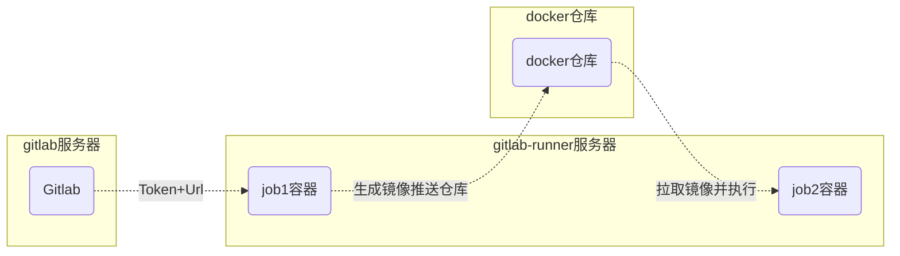

# docker快速搭建GitLab

#### 参考文档
- https://docs.gitlab.com/
- https://docs.gitlab.cn/
- https://golangci-lint.run/

#### 实现原理

1. 推送代码至 gitlab，根据 runner 配置规则触发 git-runner
2. git-runner 容器拉取代码，并启动 runner 配置文件中预先配置好的镜像执行 job
3. build job 对代码进行编译并打包成本地镜像，也可以同时将镜像推送至 Docker 仓库
4. deploy job 通过 ssh 登录远程部署服务器拉取 Docker 仓库中的镜像，并执行 `docker run` 实现远程服务器部署

#### 1.Gitlab 安装

```shell
sudo docker run --detach \
  --hostname localhost \
  --publish 443:443 --publish 80:80 --publish 22:22 \
  --name gitlab \
  --restart always \
  --privileged \
  --volume /home/docker/gitlab/config:/etc/gitlab \
  --volume /home/docker/gitlab/logs:/var/log/gitlab \
  --volume /home/docker/gitlab/data:/var/opt/gitlab \
  gitlab/gitlab-ce:latest
```
#### 2.项目创建
创建一个开发项目，打开 Settings->Genneral->Pipeliness 设置

#### Gitlab-Runner 安装

```shell
sudo docker run -d --name gitlab-runner --restart always \
  -v /home/gitlab-runner/config:/etc/gitlab-runner \
  -v /var/run/docker.sock:/var/run/docker.sock \
  -v /usr/bin/docker:/usr/bin/docker \
  gitlab/gitlab-runner:latest
```

```shell
# docker 套接字
/var/run/docker.sock:/var/run/docker.sock

# gitlab-runner 配置文件
# gitlab-runner 启动后可以在 /home/gitlab-runner/config 文件夹中找到配置文件进行修改
# gitlab-runner 每 3 秒扫描一次该文件
/home/gitlab-runner/config:/etc/gitlab-runner

# docker 目录
/usr/bin/docker:/usr/bin/docker
```

#### 3.Gitlab-Runner 注册
在开发项目的设置 ->CI/CD->Runner 找到 url 和 registration-token

```shell
docker run --rm -v /home/gitlab-runner/config:/etc/gitlab-runner gitlab/gitlab-runner register \
  --non-interactive \
  --executor "docker" \
  --docker-image "golang:1.18" \
  --docker-privileged=false \
  --docker-pull-policy="if-not-present" \
  --url "" \
  --registration-token "" \
  --description "golang-app-runner" \
  --tag-list "golang-app" \
  --run-untagged="true" \
  --locked="false" \
  --access-level="not_protected" \
  --docker-volumes /var/run/docker.sock:/var/run/docker.sock \
  --docker-volumes /usr/bin/docker:/usr/bin/docker
```

#### 4.运行流水线
在开发项目根目录里面创建一个`.gitlab-ci.yml`

```yaml
# image: golang:1.18 
# runner配置文件中预先配置好的镜像是docker，其他镜像可以放到每个stage设置或者Dockerfile文件设置

before_script:
  - ls
  - docker version
  - export env="dev"

stages: # 分段
# - install
  - lint
  - build
  - deploy

# cache: # 缓存
#  key: xxx
#  paths:
#    - /home/xxx

job_lint:
  tags:
    - golang-app
  stage: lint
  image: golangci/golangci-lint:v1.51.2
  script:
    - golangci-lint --version
    - golangci-lint run -v
  only:
    - merge_requests

job_build:
  tags:
    - golang-app
  stage: build
  image: docker
  script: # 此处需要项目根目录有Dockerfile文件
    - docker build -t lol-app:v1  .
  only:
    - master

job_deploy:
  tags:
    - golang-app
  stage: deploy
  script: # 启动项目
    - docker run -d --name=lol-app -v opt/logs:app/logs --restart=always lol-app:v1
  only:
    - master
```

项目根目录下新建 golangci-lint 的配置文件 .golangci.yml
```yaml
linters-settings:
  asasalint:
    # To specify a set of function names to exclude.
    # The values are merged with the builtin exclusions.
    # The builtin exclusions can be disabled by setting `use-builtin-exclusions` to `false`.
    # Default: ["^(fmt|log|logger|t|)\.(Print|Fprint|Sprint|Fatal|Panic|Error|Warn|Warning|Info|Debug|Log)(|f|ln)$"]
    exclude:
      - Append
      - \.Wrapf
    # To enable/disable the asasalint builtin exclusions of function names.
    # See the default value of `exclude` to get the builtin exclusions.
    # Default: true
    use-builtin-exclusions: false
    # Ignore *_test.go files.
    # Default: false
    ignore-test: true
 funlen:
    # Checks the number of lines in a function.
    # If lower than 0, disable the check.
    # Default: 60
    lines: -1
    # Checks the number of statements in a function.
    # If lower than 0, disable the check.
    # Default: 40
    statements: -1
 lll:
    # Max line length, lines longer will be reported.
    # '\t' is counted as 1 character by default, and can be changed with the tab-width option.
    # Default: 120.
    line-length: 120
    # Tab width in spaces.
    # Default: 1
    tab-width: 1
```
- before_script
声明 runner 在每个 job 中都要执行该操作列出的所有命令

- stages
声明了三个阶段 lint，build，deploy，三个阶段会先后执行，同一阶段中的多个 job 会并行执行

- job_lint
声明了一个 job，该 job 指定为 lint 阶段，在该阶段中执行了 lint 命令，only 字段标识该 job 只在 merge_requests 分支合并时触发

- job_build
声明了一个 job，该 job 指定为 build 阶段，在该阶段中执行了 docker build -t 镜像构建命令，only 字段标识该 job 只在 master 分支中触发，其他分支 runner 不会执行该工作

- job_deploy
声明了一个 job，该 job 指定为 deploy 阶段，该阶段执行 docker run 启动了上一阶段中生成的镜像，实现服务的部署

- Dockerfile 文件
实例：go-zero 微服务框架开发的单体应用 `https://github.com/1191226989/go-zero-lol`

```dockerfile
FROM golang:alpine AS builder

LABEL stage=gobuilder

ENV CGO_ENABLED 0
ENV GOPROXY https://goproxy.cn,direct
RUN sed -i 's/dl-cdn.alpinelinux.org/mirrors.aliyun.com/g' /etc/apk/repositories

RUN apk update --no-cache && apk add --no-cache tzdata

WORKDIR /build

ADD go.mod .
ADD go.sum .
RUN go mod download
COPY . .
COPY ./etc /app/etc
RUN go build -ldflags="-s -w" -o /app/lol lol.go


FROM scratch

COPY --from=builder /etc/ssl/certs/ca-certificates.crt /etc/ssl/certs/ca-certificates.crt
COPY --from=builder /usr/share/zoneinfo/Asia/Shanghai /usr/share/zoneinfo/Asia/Shanghai
ENV TZ Asia/Shanghai

WORKDIR /app
COPY --from=builder /app/lol /app/lol
COPY --from=builder /app/etc /app/etc

CMD ["./lol", "-f", "etc/lol-api.yaml"]
```
