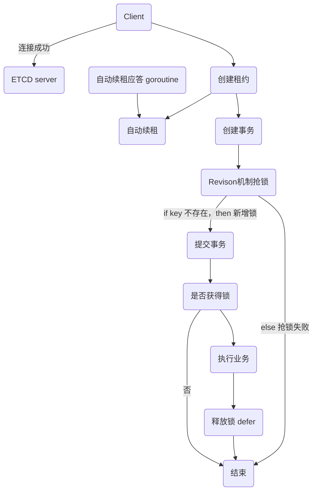

# etcd分布式锁

#### Etcd特性介绍：
- **Lease机制**：即租约机制(TTL,Time To Live)，etcd可以为存储的kv对设置租约，当租约到期，kv将失效删除；同时也支持续约，keepalive； 可以用于异常情况下的锁自动释放能力
- **Revision机制**：每个key带有一个Revision属性值，etcd每进行一次事务对应的全局Revision值都会+1，因此每个key对应的Revision属性值都是全局唯一的。通过比较Revision的大小就可以知道进行写操作的顺序。在实现分布式锁时，多个程序同时抢锁，根据Revision值大小依次获得锁，避免“惊群效应”，实现公平锁和排队等待的能力
- **Prefix机制**：也称为目录机制，可以根据前缀获得该目录下所有的key及其对应的属性
- **Watch机制**：watch支持watch某个固定的key或者一个前缀目录，当watch的key发生变化，客户端将收到通知，用于抢锁能力
- **集群模式**：用于支撑锁服务的高可用

#### 流程图


1. 创建一个租约

```go
leaseResp, err := cli.Grant(Context.Background(), 10)
if err != nil {
  log.Fatal(err)
}
```

2. 尝试获取锁

```go
lockKey := "my-lock"
kv := clientv3.NewKV(cli)
txn := kv.Txn(context.Background())

// 如果没有其他节点已经持有该键，则通过创建一个空值来获得该键并与租约关联。
txn.If(clientv3.Compare(clientv3.CreateRevision(lockKey), "=", 0)).Then(
  clientv3.OpPut(lockKey, "", clientv3.WithLease(leaseResp.ID)),
).Else(
  err = errors.New("failed to aquire lock")
)

resp, err := txn.Commit()
if err != nil {
  log.Fatal(err)
}
if !resp.Successed {
  log.Fatal("failed to acquire lock")
}
```

3. 保持租约有效

```go
keepAliveChan, err := cli.KeepAlive(context.Background(), leaseResp.ID)
if err != nil {
  log.Fatal(err)
}

for {
  select {
    case <- keepAliveChan:
      // 租期续约成功
    case <- time.After(time.Second * 15):
      // 没有收到续期成功通知，失去锁，重新获取锁
      log.Println("Lost lock")
      // goto lock // 跳转获取锁的步骤
  }
}
```

4. 释放锁
```go
_, err := kv.Delete(context.Background(), lockKey)
if err != nil {
  log.Fatal(err)
}
```

完整代码
```go
func main() {
    config := clientv3.Config{
        Endpoints:   []string{"xxx.xxx.xxx.xxx:2379"},
        DialTimeout: 5 * time.Second,
    }
 
    // 获取客户端连接
    client, err := clientv3.New(config)
    if err != nil {
        fmt.Println(err)
        return
    }
 
    // 1. 上锁（创建租约，自动续租，拿着租约去抢占一个key ）
    // 用于申请租约
    lease := clientv3.NewLease(client)
 
    // 申请一个10s的租约
    leaseGrantResp, err := lease.Grant(context.TODO(), 10) //10s
    if err != nil {
        fmt.Println(err)
        return
    }
 
    // 拿到租约的id
    leaseID := leaseGrantResp.ID
 
    // 准备一个用于取消续租的context
    ctx, cancelFunc := context.WithCancel(context.TODO())
 
    // 确保函数退出后，自动续租会停止
    defer cancelFunc()
        // 确保函数退出后，租约会失效
    defer lease.Revoke(context.TODO(), leaseID)
 
    // 自动续租
    keepRespChan, err := lease.KeepAlive(ctx, leaseID)
    if err != nil {
        fmt.Println(err)
        return
    }
 
    // 处理续租应答的协程
    go func() {
        select {
        case keepResp := <-keepRespChan:
            if keepRespChan == nil {
                fmt.Println("lease has expired")
                goto END
            } else {
                // 每秒会续租一次
                fmt.Println("收到自动续租应答", keepResp.ID)
            }
        }
    END:
    }()
 
    // if key 不存在，then设置它，else抢锁失败
    kv := clientv3.NewKV(client)
    // 创建事务
    txn := kv.Txn(context.TODO())
    // 如果key不存在
    txn.If(clientv3.Compare(clientv3.CreateRevision("/cron/lock/job7"), "=", 0)).
        Then(clientv3.OpPut("/cron/jobs/job7", "", clientv3.WithLease(leaseID))).
        Else(clientv3.OpGet("/cron/jobs/job7")) //如果key存在
 
    // 提交事务
    txnResp, err := txn.Commit()
    if err != nil {
        fmt.Println(err)
        return
    }
 
    // 判断是否抢到了锁
    if !txnResp.Succeeded {
        fmt.Println("锁被占用了：", string(txnResp.Responses[0].GetResponseRange().Kvs[0].Value))
        return
    }
 
    // 2. 处理业务（锁内，很安全）
 
    fmt.Println("处理任务")
    time.Sleep(5 * time.Second)
 
    // 3. 释放锁（取消自动续租，释放租约）
    // defer会取消续租，释放锁
}

```
### concurrency包实现分布式锁
clientv3提供的concurrency包也实现了分布式锁，主要流程如下：
- 首先通过concurrency.NewSession方法创建Session，本质上是创建了一个TTL为10的Lease
- 得到Session对象后，通过concurrency.NewMutex创建一个mutex对象，包括了Lease、key prefix等信息
- 然后听过mutex对象的Lock方法尝试获取锁
- 最后通过mutex对象的Unlock方法释放锁

```go
    config := clientv3.Config{
        Endpoints:   []string{"xxx.xxx.xxx.xxx:2379"},
        DialTimeout: 5 * time.Second,
    }
 
    // 获取客户端连接
    cli, err := clientv3.New(config)
    if err != nil {
        log.Fatal(err)
    }
    defer cli.Close()

    session, err := concurrency.NewSession(cli, concurrency.WithTTL(10))
    if err != nil {
      log.Fatal(err)
    }
    defer session.Close()

    mux := concurrency.NewMutex(session, "sesslock")
    if err := mux.Lock(context.Background()); err != nil {
      log.Fatal(err)
    }

    // 2. 处理业务（锁内，很安全）

    if err := mux.Unlock(context.Background()); err != nil {
      log.Fatal(err)
    }

```


