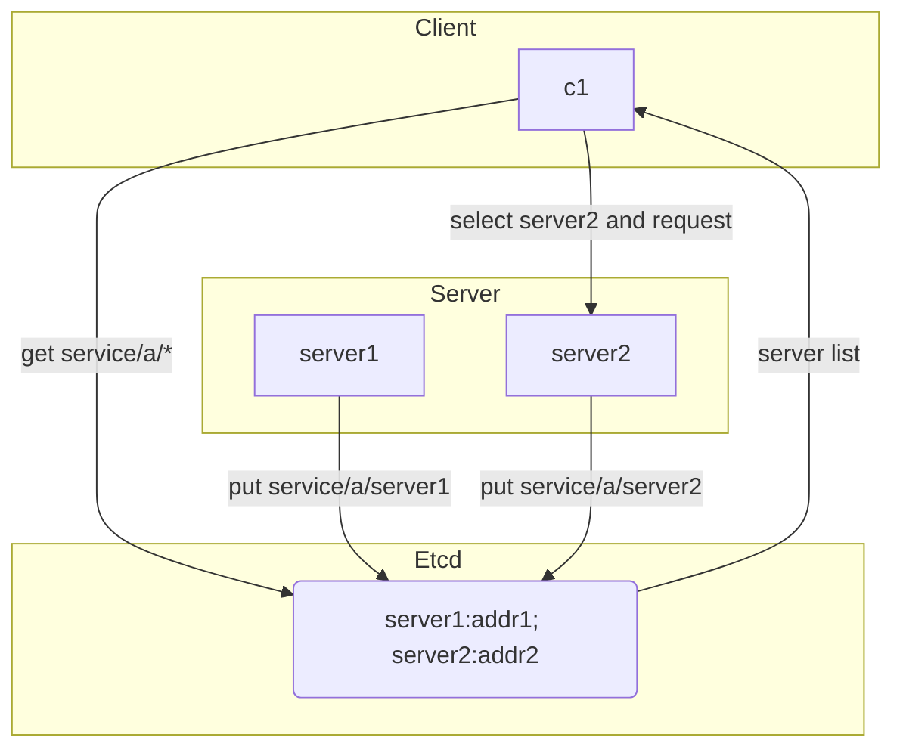

# etcd微服务注册发现

在使用 etcd 作为服务注册/发现模块时，同一个服务组在 etcd 中会以相同的服务名作为共同的标识键前缀，与各服务节点的信息建立好映射关系，以实现所谓的“服务注册”功能.

#### 简单方案



1. 服务注册
```go
import (
    "context"
    "go.etcd.io/etcd/client/v3"
)

// 创建etcd客户端
cli, err := clientv3.New(clientv3.Config{
        Endpoints:   []string{"localhost:2379", "localhost:22379", "localhost:32379"}, // etcd服务器地址
        DialTimeout: 5 * time.Second,
})
if err != nil {
    log.Fatal(err)
}

defer cli.Close() // 关闭连接

// 注册服务，key为“service/name/server1”，value为IP和端口号
lease := clientv3.NewLease(cli)
grantResp, _ := lease.Grant(context.Background(), 10) // 设置租约时间为10秒

grantRespChan, err := lease.KeepAlive(context.Background(), grantResp.ID)
if err != nil {
    log.Fatal(err)
}

_, err = cli.Put(context.Background(), "service/name/svr1", "127.0.0.1:8080", clientv3.WithLease(grantResp.ID))
if err != nil {
    log.Fatal(err)
}

// 可省略这部分代码
for {
  select {
    case s := <-grantRespChan:
      fmt.Println("heart beat: ", s.String()) // 心跳信息
  }
}
```

2. 服务发现
```go
import (
    "context"
    "fmt"
    "go.etcd.io/etcd/client/v3"
)

// 创建etcd客户端
cli, err := clientv3.New(clientv3.Config{
        Endpoints:   []string{"localhost:2379", "localhost:22379", "localhost:32379"}, // etcd服务器地址
        DialTimeout: 5 * time.Second,
})
if err != nil {
    log.Fatal(err)
}

defer cli.Close() // 关闭连接

// 获取服务列表，前缀为“service/name/”
resp, err := cli.Get(context.Background(), "service/name/", clientv3.WithPrefix())
if err != nil {
    log.Fatal(err)
}

for _, ev := range resp.Kvs {
    fmt.Printf("%s : %s\n", ev.Key, ev.Value)
}
```

#### gRPC naming and discovery
https://etcd.io/docs/v3.5/dev-guide/grpc_naming/

1. 服务端
```go
package main

import (
    "context"
    "flag"
    "fmt"
    "net"
    "time"

    // grpc 桩代码
    "github.com/grpc_demo/proto"

    clientv3 "go.etcd.io/etcd/client/v3"
    "go.etcd.io/etcd/client/v3/naming/endpoints"
    "google.golang.org/grpc"
)

const (
  // grpc 服务名
  MyService = "test/hello"
  MyEtcdURL = "http://localhost:2379"
)

type Server struct{
  proto.UnimplementedHelloServiceServer
}

func main(){
  var port int
  flag.IntVar(&port, "port", 8080, "port")
  flag.Parse()
  addr := fmt.Sprintf("http://localhost:%d", port)

  listener, _ := net.Listen("tcp", addr)
  server := grpc.NewServer()
  proto.RegisterHelloServiceServer(server, &Server{})

  ctx, cancel := context.WithCancel(context.Background())
  defer cancel()

  // 注册grpc服务节点到etcd
  go registerEndPointToEtcd(ctx, addr)

  // 启动grpc服务
  if err := server.Serve(listener); err!=nil {
    fmt.Println(err)
  }
}

func registerEndPointToEtcd(ctx context.Context, addr string){
  // 创建etcd客户端
  cli, err := clientv3.NewFromURL(MyEtcdURL)
  if err != nil {
    log.Fatal(err)
  }

  em, err := endpoints.NewManager(cli, MyService)
  if err != nil {
    log.Fatal(err)
  }

  // 创建租约
  var ttl int64 = 10
  lease, err := cli.Grant(ctx, ttl)
  if err != nil {
    log.Fatal(err)
  }

  // 添加节点到etcd
  err := em.AddEndpoint(ctx, fmt.Spintf("%s/%s", MyService, add), endpoints.Endpoint{Addr: addr}, clientv3.WithLease(lease.ID)
  if err != nil {
    log.Fatal(err)
  }

  // 每隔5s续期租约
  for {
    select {
      case <- time.After(5 * time.Second):
        resp, err := clientv3.KeepAliveOnce(ctx, lease.ID)
        if err != nil {
          log.Fatal(err)
        }
        fmt.Printf("keep alive resp: %+v", resp)
      case <- ctx.Done():
        return
    }
  }
}
```

2. 客户端

```go
package main

import (
    "context"
    "fmt"
    "time"

    // grpc 桩文件
    "github.com/grpc_demo/proto"

    clientv3 "go.etcd.io/etcd/client/v3"
    resolver "go.etcd.io/etcd/client/v3/naming/resolver"

    // grpc
    "google.golang.org/grpc"
    "google.golang.org/grpc/balancer/roundrobin"
    "google.golang.org/grpc/credentials/insecure"
)

const (
  // grpc 服务名
  MyService = "test/hello"
  MyEtcdURL = "http://localhost:2379"
)

func main(){
  cli, err := clientv3.NewFromURL(MyEtcdURL)
  if err != nil {
    log.Fatal(err)
  }

  // 创建ectd自带的grpc服务注册发现模块 resolver
  etcdResolver, err := resolver.NewBuilder(cli);
  if err != nil {
    log.Fatal(err)
  }
  // 组装服务名称，需要以etcd:/// 作为前缀
  etcdTarget ：= fmt.Sprintf("etcd:///%s", MyService)

  // 创建grpc连接代理
  conn, err := grpc.Dial(etcdTarget, grpc.WithResolvers(etcdRosolver))
  if err != nil {
    log.Fatal(err)
  }
  defer conn.Close()

  // 创建 grpc 客户端
  client := proto.NewHelloServiceClient(conn)
  resp, err := client.SayHello(context.Background(), &proto.HelloReq{
    Name: "tester",
  })
  if err != nil {
    log.Fatal(err)
  }
  fmt.Printf("resp: %+v", resp)
}
```


