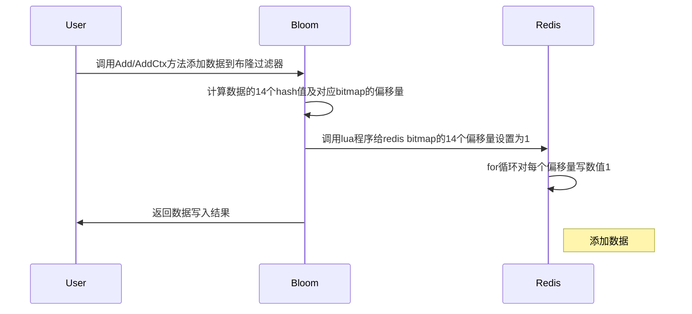
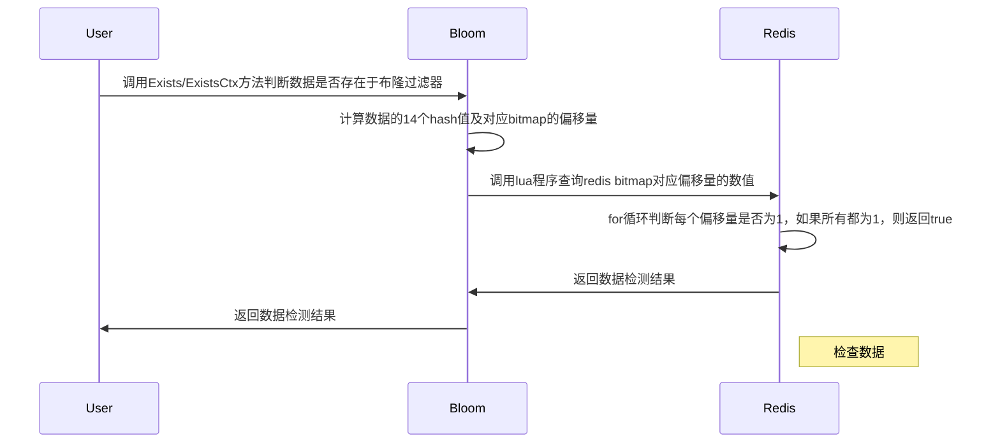

# go-zero-布隆过滤器

https://github.com/zeromicro/go-zero/blob/master/core/bloom/bloom.go

布隆过滤器（英語：Bloom Filter）是1970年由布隆提出的。它实际上是一个很长的二进制向量和一系列随机映射函数。布隆过滤器可以用于检索一个元素是否在一个集合中。它的优点是空间效率和查询时间都远远超过一般的算法，缺点是有一定的误识别率和删除困难。

判断一个值是否在一个集合中，这个判断结果允许有一定的误差，简单的解决方案如下：
```go
func contains(list []any, item any) bool {
   for _, i := range list {
      if i == item {
         return true
      }
   }

   return false
}
```
该算法的时间复杂度为 `O(n)`，从 `100w` 数据判断是否存在某一个元素是否存在，优化方案是首先要降低时间复杂度：
```go
func contains(m map[any]struct{}, item any) bool {
   _, ok := m[item]
   return ok
}
```
将数据结构稍作修改，从数组改为 `map`，其时间复杂度由原来的 `O(n)` 降低至 `O(1)`，简单从时间复杂度上来看是已经能够完全解决问题了。如果考虑空间复杂度，那么数组和 `map` 的空间复杂度都是 `O(n)`，100万的数据如果一个数据空间暂用为 `1k`，那么 100万数据暂用空间约 `980Mb`，如果每个视频的评论积赞数都用这个算法，那以目前短视频这种量，一个视频得搞 `1G` 来存，这显然行不通的。

`redis` 的 `bitmap` 是基于字符串的，如果按照一个用户一个偏移量来计算，100万个用户的点赞大约会用约 `12k` 的空间，且读写的时间复杂度均是 `O(1)`，这相对于 `map` 来看，优化空间量级非常大也很可观，假设一个用户平均每个视频有100万赞，每个用户终身暂定有 `10000` 个视频，那么一个用户需要消耗 `117 Mb`，这个相比于用户给平台带来的收益那是微乎其微的。如果该公司有1亿用户，且每个用户都需要消耗`117Mb`，那么所有用户将消耗 `11158 Tb`,按照目前 `redis` 行情计算，集群版2分片（每分片 `1G` 存储）计算，大约 2900元/年，因此 `11158 Tb` 一年要花费 **331 亿元**。

#### 布隆过滤器原理
布隆过滤器的原理是当一个元素被加入集合时，通过`K`个散列函数将这个元素映射成一个位数组中的`K`个点，把它们置为`1`。检索时只要看看这些点是不是都是`1`就（大约）知道集合中是否存在该元素了。如果这些点有任何一个`0`，则被检元素一定不在；如果都是`1`，则被检元素很可能在。这就是布隆过滤器的基本思想。

如果用布隆过滤器，则可以缩小 `2^k`，假设 `k` 为 `16`，那么上述费用立马会从**331亿元**减少至约**51万元**。

布隆过滤器相比于其他数据结构，其时间复杂度和空间复杂度都有足够的优势，但空间复杂度的优势又是其劣势，将1亿个用户，每个用户100万数据落在固定长度中的某 `k` 位位图上，其会有冲突概率的，因此给业务带来的感知是误算率会随着位图的长度降低而增高，由于冲突导致的误算，因此布隆过滤器是不允许做删除操作的，因为无法确定多少个冲突数据落在了同一个 `k` 个点上。

#### go-zero 布隆过滤器算法
go-zero 中的布隆过滤器也是基于 `redis bitmap` 的，其主要由 4 个方法组成：
```go
type Bloom interface{
  Add(data []byte) error
  AddCtx(ctx context.Context, data []byte) error
  Exists(data []byte) (bool, error)
  ExistsCtx(ctx context.Context, data []byte) (bool, error)
}
```
- 算法时序图


- 计算偏移量 - `getLocations`
```go
func (f *Filter) getLocations(data []byte) []uint {
   locations := make([]uint, maps)
   for i := uint(0); i < maps; i++ {
      hashValue := hash.Hash(append(data, byte(i)))
      locations[i] = uint(hashValue % uint64(f.bits))
   }

   return locations
}
```
根据维基百科定义，『通过`K`个散列函数将这个元素映射成一个位数组中的`K`个点』，那么期望结果是每个散列函数映射的偏移量都不同，在 go-zero 中，其巧妙通过散列函数的索引与数据字节组重组成一个字节组来对新的字节组进行 `hash` 计算得到不同的 `hash` 值，然后再将该值与用户期望的位图长度进行取模计算得到偏移量。

- `Bitmap setbit` 操作
```lua
// 对 redis bitmap 进行 setbit 操作
var setScript = redis.NewScript(`
for _, offset in ipairs(ARGV) do
   redis.call("setbit", KEYS[1], offset, 1)
end
`)
```
```go
func (r *redisBitSet) set(ctx context.Context, offsets []uint) error {
   ...
   _, err = r.store.ScriptRunCtx(ctx, setScript, []string{r.key}, args)
   if err == redis.Nil {
      return nil
   }

   return err
}
```

- `Bitmap getbit` 操作
```lua
// 对 redis getbit 进行 setbit 操作
var testScript = redis.NewScript(`
for _, offset in ipairs(ARGV) do
   if tonumber(redis.call("getbit", KEYS[1], offset)) == 0 then
      return false
   end
end
return true
`)
```
```go
func (r *redisBitSet) check(ctx context.Context, offsets []uint) (bool, error) {
   ...
   resp, err := r.store.ScriptRunCtx(ctx, testScript, []string{r.key}, args)
   if err == redis.Nil {
      return false, nil
   } else if err != nil {
      return false, err
   }

   exists, ok := resp.(int64)
   if !ok {
      return false, nil
   }

   return exists == 1, nil
}
```

#### 使用案例
```go
package main

import (
	"fmt"

	"github.com/zeromicro/go-zero/core/bloom"
	"github.com/zeromicro/go-zero/core/stores/redis"
)

func main() {
	store := redis.New("localhost:6379")
	filter := bloom.New(store, "testbloom", 64)
	filter.Add([]byte("kevin"))
	filter.Add([]byte("wan"))
	fmt.Println(filter.Exists([]byte("kevin")))
	fmt.Println(filter.Exists([]byte("wan")))
	fmt.Println(filter.Exists([]byte("nothing")))
}
```

#### 应用场景
- 网页爬虫对 URL 去重，避免爬取相同的 URL 地址
- 反垃圾邮件，从数十亿个垃圾邮件列表中判断某邮箱是否垃圾邮箱
- Google Chrome 使用布隆过滤器识别恶意 URL
- Medium 使用布隆过滤器避免推荐给用户已经读过的文章
- Google BigTable，Apache HBbase 和 Apache Cassandra 使用布隆过滤器减少对不存在的行和列的查找
- 解决缓存穿透问题，预先把数据查询的主键，比如用户 ID 或文章 ID 缓存到过滤器中。
当根据 ID 进行数据查询的时候，先通过布隆过滤器判断数据是否存在，如果不存在，则直接返回，这样就减少触发后续的数据库查询。由于布隆过滤器只能判断数据可能存在或者一定不存在，所以无法完全解决缓存穿透的问题，但可以将其控制在一个可容忍的范围内。

