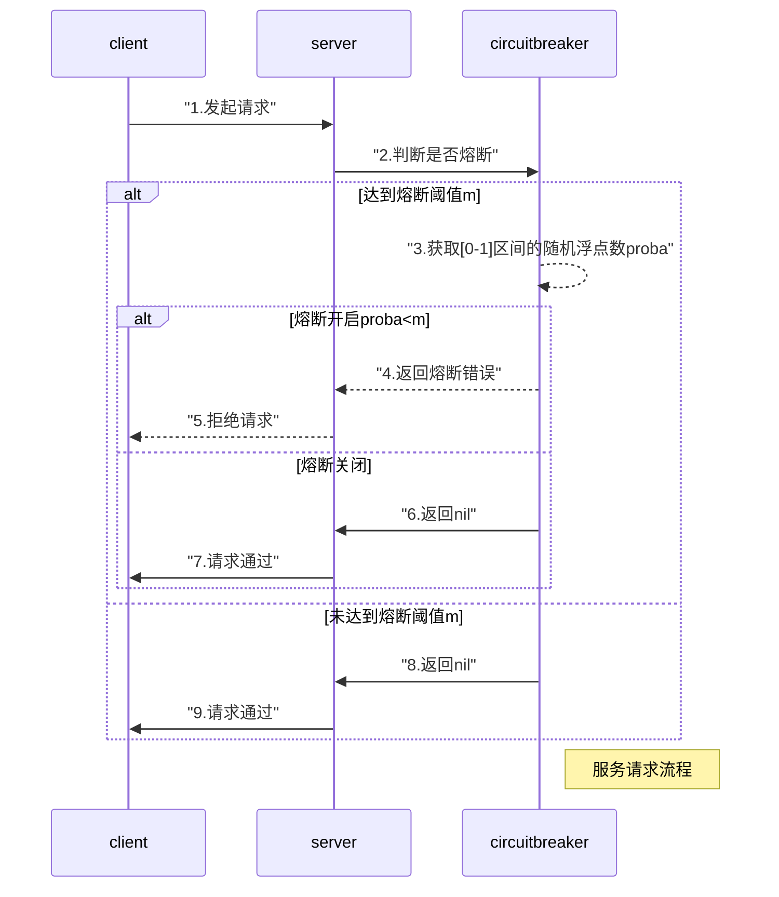
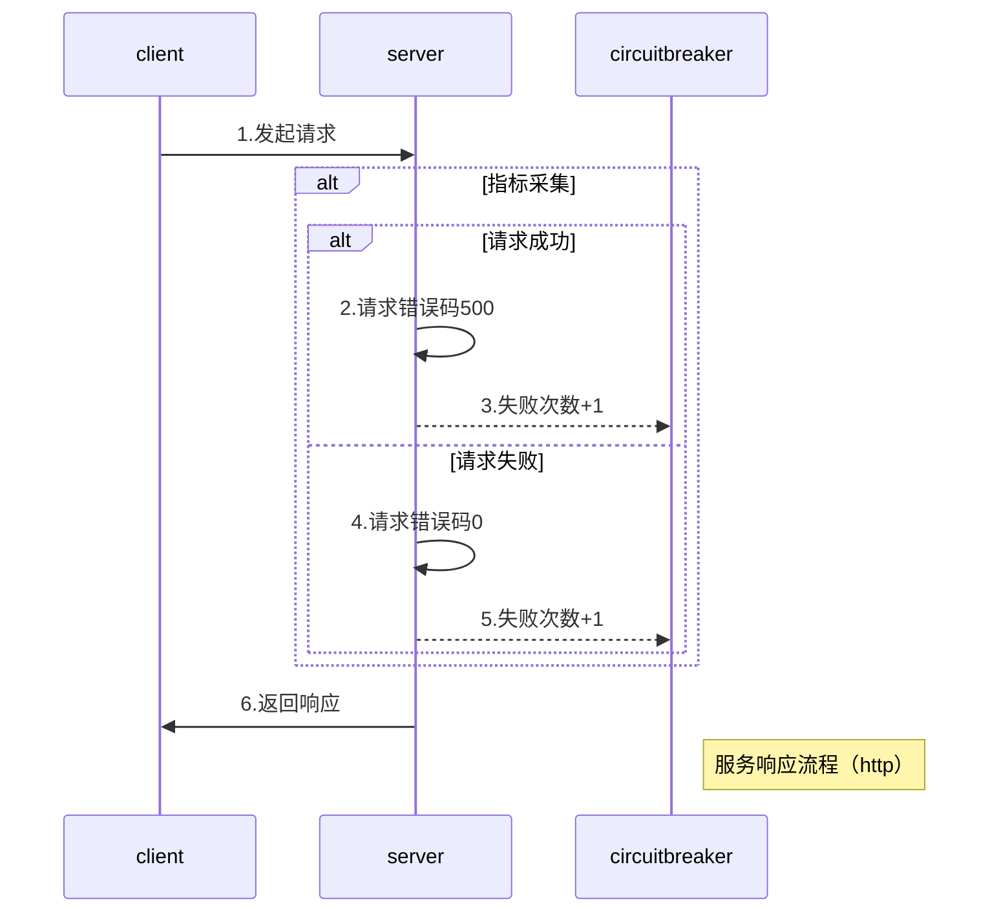
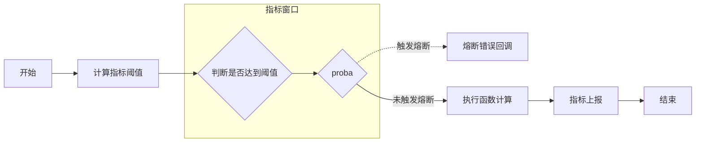

# go-zero-熔断保护

熔断机制是一种微服务保护机制。当某个微服务出现故障或者异常时，通过熔断机制可以防止故障或异常扩散到整个微服务系统中，从而避免整个微服务系统被拖垮，熔断机制的大致流程是（以下流程基于 go-zero 熔断器）：

- 指标采集：熔断器通过不断监测服务的请求和响应来收集指标，这些指标包含但不限于响应时间，错误率，超时率等。
- 阈值设定：熔断器通过指标来计算出阈值，当指标超过阈值时，熔断器会打开。
- 熔断状态控制：一般熔断器都有3个状态，熔断开启，熔断恢复，熔断半开。

熔断开启：当服务的指标超过设定的阈值时，熔断机制将服务切换到熔断状态。在熔断状态下，服务将停止接收新的请求，并立即返回错误响应，而不会进行实际的业务逻辑处理。

熔断恢复：一旦服务进入熔断状态，熔断机制会设定一个恢复时间窗口，在该窗口内不再接收新的请求。在这段时间内，系统可以尝试修复服务或等待服务自动恢复。

半开状态：在熔断恢复时间窗口结束后，熔断机制将服务切换到半开状态。在半开状态下，系统会尝试发送一部分请求给服务，以检测其是否已经恢复正常。如果这些请求成功响应，那么服务将被认为是恢复正常，并继续接收新的请求。否则，服务将重新进入熔断状态。

在 `go-zero` 中熔断指标达到设定阈值后，并不是直接拦截所有请求，而是有一定的概率拦截请求，go-zero 中熔断器将**熔断恢复**和**熔断半开**这2个状态巧妙的用滑动窗口来实现了。

#### go-zero 熔断器时序图



#### 源码解析
在 `go-zero` 中`Breaker` 是一个接口，其接口定义如下：
```go
Breaker interface {
   Name() string
   Allow() (Promise, error)
   Do(req func () error) error
   DoWithAcceptable(req func () error, acceptable Acceptable) error
   DoWithFallback(req func () error, fallback func (err error) error) error
   DoWithFallbackAcceptable(req func () error, fallback func (err error) error, acceptable Acceptable) error
}
```
`Breaker` 接口定义了 6 个方法，提供了 2 种对熔断器控制执行的机制：

`Allow` 方法抛出了一个 `Promise` 句柄，允许用户自行对熔断指标进行控制，采集指标可以根据用户需求选择请求时延、错误码等，且熔断触发后需要执行的逻辑也有用户自行控制。例如 `go-zero` 中 `rest` 中熔断中间件的用法：
```go
func BreakerHandler(method, path string, metrics *stat.Metrics) func(http.Handler) http.Handler {
 brk := breaker.NewBreaker(breaker.WithName(strings.Join([]string{method, path}, breakerSeparator)))
 return func(next http.Handler) http.Handler {
     return http.HandlerFunc(func(w http.ResponseWriter, r *http.Request) {
         promise, err := brk.Allow()// 熔断执行逻辑，用户自行控制
         if err != nil {
             metrics.AddDrop()
             logx.Errorf("[http] dropped, %s - %s - %s",
                 r.RequestURI, httpx.GetRemoteAddr(r), r.UserAgent())
             w.WriteHeader(http.StatusServiceUnavailable)
             return
         }

         cw := &response.WithCodeResponseWriter{Writer: w}
         defer func() {// 熔断指标采集，用户自行控制
             if cw.Code < http.StatusInternalServerError {
                 promise.Accept()
             } else {
                 promise.Reject(fmt.Sprintf("%d %s", cw.Code, http.StatusText(cw.Code)))
             }
         }()
         next.ServeHTTP(cw, r)
     })
 }
}
```

`doReq` 方法则使用的是另一种熔断器控制机制，其只能通过错误码来进行指标采集，用户可以根据错误码来控制哪些错误码是要加入到指标统计的。方法在底层逻辑最终都是调用一个基础方法，只是根据入参的不同而暴露了不同的函数：
```go
doReq(req func() error, fallback func(err error) error, acceptable Acceptable) error
```
`doReq` 方法的流程图：

```go
func (b *googleBreaker) doReq(req func() error, fallback func(err error) error, acceptable Acceptable) error {
    // 判断熔断器是否开启
    if err := b.accept(); err != nil {
        if fallback != nil {
            return fallback(err)
        }

        return err
    }

    // 函数异常退出，上报失败指标
    defer func() {
        if e := recover(); e != nil {
            b.markFailure()
            panic(e)
        }
    }()

    // 执行用户函数，并通过函数执行返回的错误信息由用户判断是否为可接受的错误
    // 上报指标
    err := req()
    if acceptable(err) {
        b.markSuccess()
    } else {
        b.markFailure()
    }

    return err
}
```

#### 熔断器状态判断
判断熔断器是否开启是根据当前窗口的历史指标来计算的，这里采用了 `google SRE` 里面的丢弃比例算法，当丢弃比例为`0`时，则无需触发熔断，否则随机触发熔断机制。
```go
func (b *googleBreaker) accept() error {
    accepts, total := b.history()
    weightedAccepts := b.k * float64(accepts)
    // https://landing.google.com/sre/sre-book/chapters/handling-overload/#eq2101
    dropRatio := math.Max(0, (float64(total-protection)-weightedAccepts)/float64(total+1))
    if dropRatio <= 0 {
        return nil
    }

    if b.proba.TrueOnProba(dropRatio) {
        return ErrServiceUnavailable
    }

    return nil
}

func (b *googleBreaker) history() (accepts, total int64) {
   b.stat.Reduce(func(b *collection.Bucket) {
      accepts += int64(b.Sum)
      total += b.Count
   })

    return
}
```

#### 指标上报
指标上报是将用户执行后的请求错误返回给用户，用户可以根据错误码指定该错误码是否纳入失败指标
```go
// 标记成功一次
func (b *googleBreaker) markSuccess() {
    b.stat.Add(1)
}

// 标记失败一次
func (b *googleBreaker) markFailure() {
    b.stat.Add(0)
}
```

熔断器的实现本质就是一个指标采集+指标计算的过程，然后用户可以根据指标计算结果来决定是否触发熔断，其中难点还是在于指标统计过程，`go-zero`这个过程是用滑动窗口来进行指标采集的。

