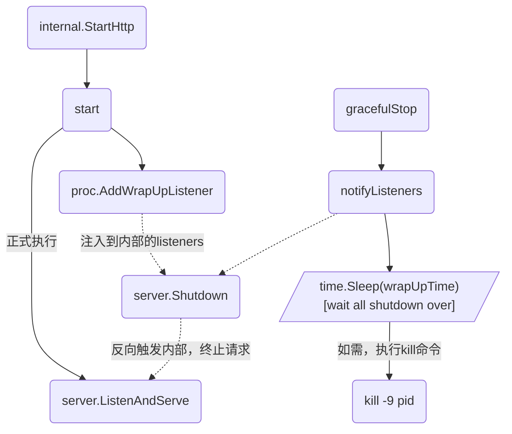

# 微服务-优雅重启和更新

在服务端程序更新或重启时，如果直接 `kill -9` 杀掉旧进程并启动新进程，会有以下几个问题：

- 旧的请求未处理完，如果服务端进程直接退出，会造成客户端链接中断（收到 `RST`）
- 新请求打过来，服务还没重启完毕，造成 `connection refused`
- 直接 `kill -9` 仍然会让正在处理的请求中断

很直接的感受就是：在重启过程中，会有一段时间不能给用户提供正常服务；同时粗鲁关闭服务，也可能会对业务依赖的数据库等状态服务造成污染。

所以服务重启或者是重新发布过程中，要做到新旧服务无缝切换，同时可以保障变更服务 零宕机时间！

#### 优雅退出

在实现优雅重启之前首先需要解决的一个问题是 如何优雅退出：

- 对 http 服务来说，一般的思路就是关闭对 `fd` 的 `listen` , 确保不会有新的请求进来的情况下处理完已经进入的请求, 然后退出。

go 原生中 http 中提供了 server.ShutDown()，先来看看它是怎么实现的：
1. 设置 inShutdown 标志
2. 关闭 listeners 保证不会有新请求进来
3. 等待所有活跃链接变成空闲状态
4. 退出函数，结束

```go
func (srv *Server) ListenAndServe() error {
    if srv.shuttingDown() {
        return ErrServerClosed
    }
    // 代码省略....
    // 实际监听端口；生成一个 listener
    ln, err := net.Listen("tcp", addr)
    if err != nil {
        return err
    }
    // 进行实际逻辑处理，并将该 listener 注入
    return srv.Serve(tcpKeepAliveListener{ln.(*net.TCPListener)})
}

func (s *Server) shuttingDown() bool {
    return atomic.LoadInt32(&s.inShutdown) != 0
}

```
`ListenAndServe` 是http启动服务器的必经函数，里面的第一句就是判断 `Server` 是否被关闭了。

`inShutdown` 就是一个原子变量，非0表示被关闭。

```go
func (srv *Server) Serve(l net.Listener) error {
    //...
    // 将注入的 listener 加入内部的 map 中
    // 方便后续控制从该 listener 链接到的请求
    if !srv.trackListener(&l, true) {
        return ErrServerClosed
    }
    defer srv.trackListener(&l, false)
    ...
}

```
`Serve` 中注册到内部 listeners map 中 `listener`，在 `ShutDown` 中就可以直接从 `listeners` 中获取到，然后执行 `listener.Close()`，TCP四次挥手后，新的请求就不会进入了。

`closeIdleConns`简单来说就是：将目前 `Server` 中记录的活跃链接变成变成空闲状态，返回。

```go
func (srv *Server) Serve(l net.Listener) error {
  //代码省略...
  for {
    rw, err := l.Accept()
    // 此时 accept 会发生错误，因为前面已经将 listener close了
    if err != nil {
      select {
      // 又是一个标志：doneChan
      case <-srv.getDoneChan():
        return ErrServerClosed
      default:
      }
    }
  }
}

```
其中 `getDoneChan` 中已经在前面关闭 `listener` 时，对 `doneChan` 这个`channel`中push。

总结一下：`Shutdown` 可以优雅的终止服务，期间不会中断已经活跃的链接。

服务启动后的某一时刻，服务被中断时通过**系统信号通知函数**通知程序，然后调用`Shutdown`作处理

#### 服务中断
依赖 `OS` 本身提供的 `signal`。对应 go 原生来说，`signal` 的 `Notify` 提供系统信号通知的能力。

> https://github.com/zeromicro/go-zero/blob/master/core/proc/signals.go

```go
func init() {
  go func() {
    var profiler Stopper
    
    signals := make(chan os.Signal, 1)
    signal.Notify(signals, syscall.SIGUSR1, syscall.SIGUSR2, syscall.SIGTERM)

    for {
      v := <-signals
      switch v {
      case syscall.SIGUSR1:
        dumpGoroutines()
      case syscall.SIGUSR2:
        if profiler == nil {
          profiler = StartProfile()
        } else {
          profiler.Stop()
          profiler = nil
        }
      case syscall.SIGTERM:
        // 正在执行优雅关闭的地方
        gracefulStop(signals)
      default:
        logx.Error("Got unregistered signal:", v)
      }
    }
  }()
}

```
- SIGUSR1 -> 将 goroutine 状况，dump下来，这个在做错误分析时有用
- SIGUSR2 -> 开启/关闭所有指标监控，自行控制 profiling 时长
- SIGTERM -> 真正开启 `gracefulStop`，优雅关闭

而 `gracefulStop` 的流程如下：
1. 取消监听信号，毕竟要退出了，不需要重复监听了
2. `wrap up`，关闭目前服务请求，以及资源
3. `time.Sleep()` ，等待资源处理完成，以后关闭完成
4. `shutdown` ，通知退出
5. 如果主goroutine还没有退出，则主动发送 `SIGKILL` 退出进程

这样，服务不再接受新的请求，服务活跃的请求等待处理完成，同时也等待资源关闭（数据库连接等），如有超时，强制退出。

#### 整体流程
目前 go 程序都是在 docker 容器中运行，所以在服务发布过程中，k8s 会向容器发送一个 `SIGTERM` 信号，然后容器中程序接收到信号，开始执行 `ShutDown`：

到这里，整个优雅关闭的流程就梳理完毕了。

但是还有平滑重启，这个就依赖 `k8s` 了，基本流程如下：

1. old pod 未退出之前，先启动 new pod
2. old pod 继续处理完已经接受的请求，并且不再接受新请求
3. new pod接受并处理新请求的方式
4. old pod 退出

这样整个服务重启就算是成功了，如果 new pod 没有启动成功，old pod 也可以提供服务，不会对目前线上的服务造成影响。

#### 优雅关闭代码示例
`net/http`包中`Server.Shutdown`类型的用法及代码示例

`func(srv *Server) Shutdown(ctx context.Context) error`

Shutdown 优雅地关闭服务器而不中断任何活动连接。首先关闭所有打开的侦听器，然后关闭所有空闲连接，然后无限期地等待连接返回空闲状态，然后关闭。如果提供的上下文在关闭完成之前过期，则 `Shutdown` 返回上下文的错误，否则返回关闭服务器的底层侦听器返回的任何错误。

当调用 `Shutdown` 时，`Serve`、`ListenAndServe` 和 `ListenAndServeTLS` 立即返回 `ErrServerClosed` 确保程序不退出并等待 `Shutdown` 返回。

`Shutdown` 不会尝试关闭也不会等待被劫持的连接，例如 `WebSockets` 如果需要，`Shutdown` 的调用者应单独通知此类 long-lived 连接关闭并等待它们关闭。有关注册关闭通知函数的方法，请参见`RegisterOnShutdown`。

一旦在服务器上调用了 `Shutdown`，它就不能被重用；未来对诸如 `Serve` 等方法的调用将返回 `ErrServerClosed`

例子：
```go
package main

import (
    "context"
    "log"
    "net/http"
    "os"
    "os/signal"
)

func main() {
    var srv http.Server

    idleConnsClosed := make(chan struct{})
    go func() {
        sigint := make(chan os.Signal, 1)
        signal.Notify(sigint, os.Interrupt)
        <-sigint

        // We received an interrupt signal, shut down.
        if err := srv.Shutdown(context.Background()); err != nil {
            // Error from closing listeners, or context timeout:
            log.Printf("HTTP server Shutdown: %v", err)
        }
        close(idleConnsClosed)
    }()

    if err := srv.ListenAndServe(); err != http.ErrServerClosed {
        // Error starting or closing listener:
        log.Fatalf("HTTP server ListenAndServe: %v", err)
    }

    <-idleConnsClosed
}
```

